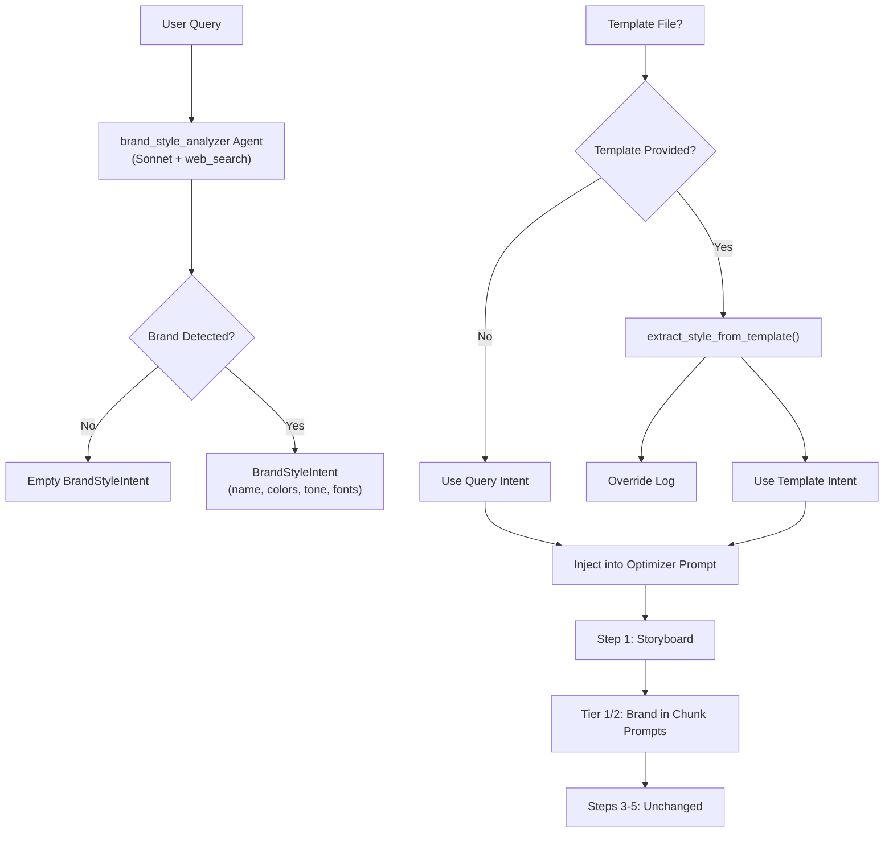

# Claude Agent Skills for Agno

## What are Claude Agent Skills?

[Claude Agent Skills](https://docs.anthropic.com/en/docs/agents-and-tools/agent-skills/quickstart) enable Claude to improve how it performs specific tasks:
- **PowerPoint (pptx)**: Create professional presentations with slides, layouts, and formatting
- **Excel (xlsx)**: Generate spreadsheets with formulas, charts, and data analysis
- **Word (docx)**: Create and edit documents with rich formatting
- **PDF (pdf)**: Analyze and extract information from PDF documents

These skills use a **progressive disclosure** architecture - Claude first discovers which skills are relevant, then loads full instructions only when needed.

## Prerequisites

Before you can use Claude Agent Skills, you'll need:

1. **Python 3.8 or higher**
2. **Anthropic API key** with access to Claude models
3. **Required Python packages (Only for file handling post its creation in Sandbox)**:
   - `anthropic` (for direct API access)
   - `agno` (for agent framework)
   - `python-pptx` (optional, for PowerPoint manipulation)
   - `openpyxl` (optional, for Excel file handling)
   - `python-docx` (optional, for Word document handling)
   - `PyPDF2` or `pdfplumber` (optional, for PDF processing)

## Installation

1. Install the required packages:
```bash
uv pip install anthropic agno

# Optional: Install document manipulation libraries
uv pip install python-pptx openpyxl python-docx PyPDF2 pdfplumber
```

2. Set up your Anthropic API key:
```bash
export ANTHROPIC_API_KEY="your_api_key_here"
```

Or create a `.env` file:
```
ANTHROPIC_API_KEY=your_api_key_here
```

## Quick Start

### Basic Direct API Usage

```python
import anthropic

client = anthropic.Anthropic()

response = client.messages.create(
    model="claude-opus-4-6",
    max_tokens=4096,
    betas=["skills-2025-10-02"],  # Enable skills beta
    container={
        "skills": [
            {"type": "anthropic", "skill_id": "pptx", "version": "latest"},
            {"type": "anthropic", "skill_id": "xlsx", "version": "latest"},
            {"type": "anthropic", "skill_id": "docx", "version": "latest"},
            {"type": "anthropic", "skill_id": "pdf", "version": "latest"},
        ]  # Enable all skills
    },
    messages=[
        {
            "role": "user",
            "content": "Create a 3-slide PowerPoint about AI trends"
        }
    ]
)
```

### Integration with Agno Agents

Agno now has native support for Claude Agent Skills! Simply pass the `skills` parameter to the Claude model:

```python
from agno.agent import Agent
from agno.models.anthropic import Claude

# Enable PowerPoint skill
agent = Agent(
    model=Claude(
        id="claude-opus-4-6",
        skills=[{"type": "anthropic", "skill_id": "pptx", "version": "latest"}]  # Enable PowerPoint skill
    ),
    instructions=[
        "You are a presentation specialist.",
        "Create professional PowerPoint presentations."
    ],
    markdown=True
)

agent.print_response("Create a sales presentation with 5 slides")
```

**Available Skills**: `pptx`, `xlsx`, `docx`, `pdf`

You can enable multiple skills at once:
```python
model=Claude(
    id="claude-opus-4-6",
    skills=[
        {"type": "anthropic", "skill_id": "pptx", "version": "latest"},
        {"type": "anthropic", "skill_id": "xlsx", "version": "latest"},
        {"type": "anthropic", "skill_id": "docx", "version": "latest"},
    ]
)
```

The framework automatically:
- Configures the required betas (`code-execution-2025-08-25`, `skills-2025-10-02`)
- Adds the code execution tool
- Uses the beta API client
- Sets up the container with skill configurations

## Available Examples

### 1. `agent_with_powerpoint.py`
Shows how to create an Agno agent specialized in PowerPoint presentations:
- Business presentation generation
- Market analysis reports
- Slide design and formatting

### 2. `agent_with_documents.py`
Examples for Word and PDF processing:
- Document creation and editing
- PDF analysis and extraction
- Format conversion

### 3. `multi_skill_agent.py`
Advanced example combining multiple skills:
- Complete business workflow (Excel → PowerPoint → PDF)
- Progressive skill loading
- Skill orchestration patterns

---

## PowerPoint Workflow Pipelines

Two production-grade PPTX generation pipelines live in this directory.
They share a layered architecture: `powerpoint_chunked_workflow.py` imports
all core logic from `powerpoint_template_workflow.py` via wildcard import.

### `powerpoint_template_workflow.py` — Single-Call Pipeline

**Best for:** Short presentations (up to ~7 slides).

A sequential Agno workflow that generates a presentation in a single Claude
API call, applies AI-generated images, assembles a branded `.pptx` template,
and optionally runs per-slide visual quality review with Gemini vision.

**Workflow steps:**

| Step | Name | Description |
|------|------|-------------|
| 1 | Content Generation | Claude + pptx skill → raw `.pptx` |
| 2 | Image Planning | Gemini decides which slides need images |
| 3 | Image Generation | NanoBanana generates slide images |
| 4 | Template Assembly | Applies template fonts, colors, layouts, OPC relationships |
| 5 (opt) | Visual Quality Review | Gemini vision renders + inspects + corrects slides |

**CLI Flags:**

```
--template, -t       Path to .pptx template (optional)
--output, -o         Output filename (default: presentation_from_template.pptx)
--prompt, -p         Presentation topic prompt
--no-images          Skip AI image generation
--no-stream          Disable streaming for Claude agent
--min-images         Min slides with AI images (default: 1)
--visual-review      Enable Step 5 Gemini vision QA (requires LibreOffice)
--footer-text        Footer text for all slides
--date-text          Date text for footer date placeholder
--show-slide-numbers Preserve slide number placeholder
--verbose, -v        Enable verbose/debug logging
```

**Run example:**

```bash
.venvs/demo/bin/python powerpoint_template_workflow.py \
    -t my_template.pptx \
    -p "Create a 5-slide overview of renewable energy trends" \
    --visual-review --footer-text "Confidential" -v
```

---

### `powerpoint_chunked_workflow.py` — Chunked Pipeline

**Best for:** Large presentations (8-15+ slides) where single Claude API calls fail.

An orchestration layer built on top of `powerpoint_template_workflow.py`.
Splits the presentation into configurable chunks (default: 3 slides per chunk),
calls Claude independently for each chunk, applies template/image/review per
chunk, then merges all chunks into the final output.

**Architecture:**

```
powerpoint_template_workflow.py   ← Core: helpers, agents, step functions (~7,147 lines)
        ↑ wildcard import
powerpoint_chunked_workflow.py    ← Orchestration: chunked generation + merge (~3,300 lines)
```

**Workflow steps:**

| Step | Name | Description |
|------|------|-------------|
| 0 | Brand/Style Parse | (within Step 1) Detects brand intent via `brand_style_analyzer` agent (Sonnet + web_search), handles template override |
| 1 | Optimize & Plan | LLM creates storyboard with brand-aware search queries, tone, per-slide content |
| 2 | Generate Chunks | Claude pptx skill called N times; brand context injected into Tier 1 & 2 prompts |
| 3 | Process Chunks | Template assembly + image pipeline per chunk |
| 4 (opt) | Visual Review | Gemini vision QA per chunk (up to --visual-passes passes each) |
| 5 | Merge Chunks | OPC-aware merge of all chunk PPTX files into final output |

**Brand/Style-Aware Query Parsing:**

The chunked pipeline includes intelligent brand/style extraction:

- **`brand_style_analyzer` agent** (Claude Sonnet with `web_search`, max 2 uses) detects brand directives in user prompts (e.g. "using Nike branding", "in the style of Apple")
- The agent autonomously decides whether to search for brand guidelines based on confidence — well-known brands may skip search, unfamiliar brands trigger a web lookup
- Returns structured `BrandStyleIntent` (brand_name, color_palette, tone, typography_hints, style_keywords)
- Brand context is injected into the optimizer prompt, Tier 1 chunk prompts, and Tier 2 code-gen prompts
- **Template override:** When a template file is provided alongside query-level branding, template styling takes precedence with a descriptive `[BRAND OVERRIDE]` log
- Downstream steps (image pipeline, visual review, merge) are unchanged

**Brand/Style Flow Diagram:**



**Key Design Decisions:**

| Decision | Rationale |
|----------|----------|
| Separate agent (not regex) | LLM decides if branding exists; no brittle patterns |
| Claude Sonnet (not Opus) | Fast, cheap — this is a lightweight analysis task |
| Web search (max 2 uses) | LLM decides whether to search for brand guidelines |
| Template overrides query | Per spec; explicit template takes precedence |
| Tier 3 unchanged | No LLM call, so brand context can't influence output |

**CLI Flags (inherits all template_workflow flags, plus):**

```
--chunk-size         Slides per Claude API call (default: 3)
--max-retries        Retries per chunk on failure (default: 2)
--visual-passes      Max visual inspection passes per chunk (default: 3)
--start-tier         Starting tier for chunk generation (default: 1):
                     1 = Claude PPTX skill (best quality, native charts/tables)
                     2 = LLM code generation (80-92% quality, faster)
                     3 = Text-only (structural only, instant, no API calls)
```

**Run examples:**

```bash
# Basic: 10 slides, 3 per chunk, no template
.venvs/demo/bin/python powerpoint_chunked_workflow.py \
    -p "Create a 10-slide AI transformation strategy deck"

# Brand-aware: Nike-branded deck
.venvs/demo/bin/python powerpoint_chunked_workflow.py \
    -p "Create a 7-slide presentation about AI trends using Nike branding"

# With template (template styling overrides query branding), visual review
.venvs/demo/bin/python powerpoint_chunked_workflow.py \
    -t my_template.pptx \
    -p "12-slide enterprise AI strategy deck" \
    --chunk-size 4 --visual-review --visual-passes 5 \
    -o final_deck.pptx

# Quick: no images, no template, large deck
.venvs/demo/bin/python powerpoint_chunked_workflow.py \
    -p "Startup pitch deck for SaaS product" --no-images
```

### Production Reliability: 3-Tier Fallback

The chunked workflow uses a 3-tier fallback system to handle Claude API
throttling, timeouts, and failures:

| Tier | Generator | Quality | Speed |
|------|-----------|---------|-------|
| 1 | Claude PPTX skill (primary) | 100% — charts, tables, rich visuals | 30s–5min/chunk |
| 2 | LLM code generation (fallback) | 80–92% — real charts via generated python-pptx code | 10–30s/chunk |
| 3 | python-pptx text-only (last resort) | Structural only — title + bullets | <1s/chunk |

Tier 2 is triggered automatically when:
- A Claude PPTX skill attempt exceeds 300 seconds
- All retries for a chunk fail with no file produced

Once triggered, all remaining chunks in the session use Tier 2/3 (never
retrying the Claude skill) to avoid further delays.

---

**Key differences from `powerpoint_template_workflow.py`:**

| Feature | `powerpoint_template_workflow.py` | `powerpoint_chunked_workflow.py` |
|---------|----------------------------------|----------------------------------|
| Slide capacity | ~7 slides (single Claude call) | 8-15+ slides (multiple Claude calls) |
| Brand/style parsing | No | Yes — `brand_style_analyzer` agent w/ web_search |
| Query optimization | No | Yes — storyboard + tone/brand context |
| Template override | N/A | Yes — template styling overrides query branding |
| Storyboard files | No | Yes — `storyboard/global_context.md` + `slide_NNN.md` |
| Chunk size control | N/A | `--chunk-size` (default 3) |
| Retry per chunk | N/A | `--max-retries` (default 2) + exponential backoff |
| Visual passes control | Fixed 3 | `--visual-passes` (default 3, configurable) |
| Template step | Step 4 | Per-chunk in Step 3 |
| Output directory | `output/` | `output_chunked/chunked_workflow_work/` |

**Logging conventions (both files):**

```
[TIMING] step_XXX completed in X.Xs   — Always printed; step and sub-op durations
[ERROR] ...                            — Always printed; failures
[WARNING] ...                          — Always printed; non-fatal issues
[VISUAL REVIEW MISSING FIX] ...       — Always printed; missing correction logic
[BRAND] ...                            — Always printed; brand detection and extraction
[BRAND OVERRIDE] ...                   — Always printed; template overriding query branding
[VERBOSE] ...                          — Only with --verbose / -v flag
```

## Features

- **Progressive Disclosure**: Skills are loaded only when needed, optimizing token usage
- **Native Code Execution**: Skills can execute Python code to create/modify documents
- **File Output**: Generated documents are created in execution sandbox (see File Downloads below)
- **Format Support**: Full support for PPTX, XLSX, DOCX, and PDF formats
- **Agno Integration**: Seamless integration with Agno's agent framework

## Important: File Downloads

**Files created by Agent Skills are NOT automatically saved to your local filesystem.**

When Claude creates a document (e.g., .pptx, .xlsx) using Agent Skills, it:
1. Creates the file in a sandboxed execution environment
2. Returns a **file ID** in the tool result
3. You must download the file separately using the [Anthropic Files API](https://docs.anthropic.com/en/docs/build-with-claude/files)

### How to Download Files

```python
import anthropic

client = anthropic.Anthropic()

# 1. Create document with skills
response = client.beta.messages.create(
    model="claude-opus-4-6",
    max_tokens=4096,
    betas=["code-execution-2025-08-25", "skills-2025-10-02"],
    container={"skills": [{"type": "anthropic", "skill_id": "pptx", "version": "latest"}]},
    messages=[{"role": "user", "content": "Create a presentation..."}],
    tools=[{"type": "code_execution_20250825", "name": "code_execution"}]
)

# 2. Extract file ID from tool results
file_id = None
for block in response.content:
    if block.type == "tool_use" and hasattr(block, "result"):
        # File ID is in the tool result
        file_id = block.result.get("file_id")

# 3. Download the file
if file_id:
    file_content = client.beta.files.download(file_id=file_id)
    with open("presentation.pptx", "wb") as f:
        f.write(file_content)
```

See `file_download_helper.py` for the shared download helper used by both workflow files.

## Configuration

### Model Requirements
- Recommended: `claude-opus-4-6` or later
- Skills require models with code execution capability
- Note: `claude-opus-4-6` is used by both the content generation step and the chunked workflow's query optimizer and fallback code generator

### Beta Version
Skills require the beta parameter:
```python
betas=["skills-2025-10-02"]
```

### Enabling Skills
Specify skills in the container parameter:
```python
# Enable only PowerPoint skill
container={
    "skills": [{"type": "anthropic", "skill_id": "pptx", "version": "latest"}]
}

# Enable all skills
container={
    "skills": [
        {"type": "anthropic", "skill_id": "pptx", "version": "latest"},
        {"type": "anthropic", "skill_id": "xlsx", "version": "latest"},
        {"type": "anthropic", "skill_id": "docx", "version": "latest"},
        {"type": "anthropic", "skill_id": "pdf", "version": "latest"},
    ]
}
```

## Performance Notes

- **Token Usage**: Skills use progressive disclosure to minimize token consumption
- **Generation Time**: Document creation may take 10-30 seconds depending on complexity
- **File Size**: Generated files are typically 50KB-5MB depending on content
- **Concurrency**: Skills can be used in parallel for multiple document types

## Use Cases

### Business Applications
- Automated report generation (Excel data → PowerPoint presentation)
- Financial analysis and visualization
- Contract and proposal creation
- Meeting notes and documentation

### Data Analysis
- CSV/Excel data visualization
- Statistical analysis with charts
- Data transformation and cleaning
- Interactive dashboards

### Document Processing
- PDF text extraction and analysis
- Document format conversion
- Template-based document generation
- Batch document processing

### Education
- Lecture slide generation
- Assignment and quiz creation
- Course material formatting
- Research paper analysis

## Limitations

- **File Size**: Large documents (>100MB) may hit token limits
- **Complex Formatting**: Some advanced formatting features may not be supported
- **External Resources**: Cannot fetch external images or data sources
- **OCR**: PDF skill focuses on text extraction, not OCR of scanned documents

## Security Notes

- **API Key**: Never commit your Anthropic API key to version control
- **File Access**: Skills operate in a sandboxed environment
- **Data Privacy**: Documents are processed through Anthropic's API
- **Output Validation**: Always validate generated documents before production use

## Troubleshooting

### "Skills not available" Error
- Ensure you're using the correct beta version: `betas=["skills-2025-10-02"]`
- Verify your API key has access to Claude models with skills
- Check that your account has skills beta access

### Code Execution Timeout
- Reduce document complexity or size
- Split large operations into smaller tasks
- Use simpler formatting when possible

### File Not Generated
- Check for errors in the response
- Verify the code execution completed successfully
- Ensure proper file paths and permissions

## Support

If you encounter any issues or have questions, please:
1. Check the [Anthropic Documentation](https://docs.anthropic.com/en/docs/agents-and-tools/agent-skills/quickstart)
2. Check the [Agno documentation](https://docs.agno.com)
3. Open an issue on the Agno GitHub repository
4. Join the Agno community for support

## Additional Resources

- [Claude Agent Skills Quickstart](https://docs.anthropic.com/en/docs/agents-and-tools/agent-skills/quickstart)
- [Anthropic API Reference](https://docs.anthropic.com/en/api)
- [Agno Documentation](https://docs.agno.com)
- [Python-PPTX Documentation](https://python-pptx.readthedocs.io/)
- [Openpyxl Documentation](https://openpyxl.readthedocs.io/)

## License

This integration follows the same license as the Agno framework.
