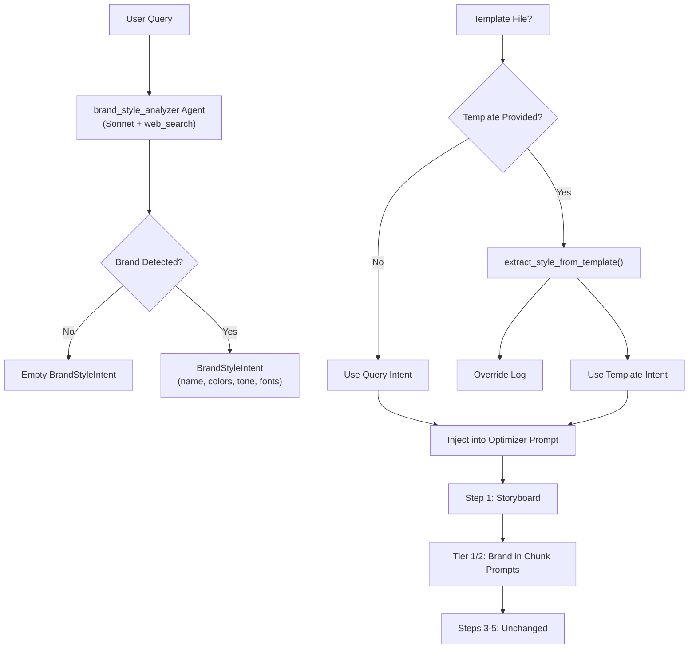

## ✅ IMPLEMENTED — Brand/Style-Aware Query Parsing

> **Status:** Implemented and tested (10/10 offline tests pass).

### Original Requirement

Conduct a thorough review of the current code logic flow in `powerpoint_chunked_workflow.py` and implement the following enhancement for intelligent brand/style-aware query parsing and contextual propagation.

When a user submits a query such as "Create a 7-slide presentation about latest AI trends in healthcare with visuals, using Nike branding," the system must parse and extract the user's styling and branding intent (e.g., "Nike branding") as a distinct, structured component separate from the core content intent (e.g., "latest AI trends in healthcare"). This extracted branding/styling context must then be incorporated into the search and retrieval pipeline so that fetched content is more contextually relevant to the branded presentation (for example, searching for "AI trends in healthcare Nike" or "Nike healthcare innovation" alongside the core topic to enrich the context). Additionally, this branding/styling intent must be passed as optimized, structured context information to the Claude skill agent across all tiers (Tier 1, Tier 2, and Tier 3), so that the agent can make better-informed decisions about tone, terminology, visual direction, color palette suggestions, and content framing. The entire downstream logic flow after this point, including image planning, image generation, visual review, and all other existing steps, must remain unchanged and continue to function as-is.

However, when the user provides an explicit template file, the system must detect this condition and extract all styling and branding information directly from the template file itself. In this scenario, any branding or styling instructions present in the user's natural language query must be explicitly ignored and overridden by the template's styling. This override decision must be clearly and descriptively captured in the logs, including the specific reason for ignoring the user's query-level styling intent (e.g., "User specified 'Nike branding' in query, but a template file was provided. Styling will be derived from the template file. Query-level branding intent has been disregarded."). The content portion of the user's query must still be fully honored and processed normally regardless of whether a template is provided.

### Implementation Summary

| Component | What Was Done |
|-----------|---------------|
| `BrandStyleIntent` model | Pydantic model with brand_name, color_palette, tone, fonts, style_keywords, source |
| `brand_style_analyzer` agent | Claude Sonnet + web_search (max 2), `output_schema=BrandStyleIntent` |
| `parse_brand_style_intent()` | Calls agent, returns structured brand data |
| `extract_style_from_template()` | Reads .pptx theme XML for colors/fonts/company name |
| `_build_brand_override_log()` | Structured override log when template overrides query |
| `_format_brand_context_for_prompt()` | Markdown prompt injection for brand context |
| Step 1 integration | Brand parsing → template override → optimizer prompt injection |
| Tier 1 integration | Brand context in chunk prompts |
| Tier 2 integration | Brand context in code-gen prompts |
| Tier 3 | Unchanged (no LLM call) |
| Steps 3-5 | Unchanged (image, review, merge) |
| Tests | 10/10 offline tests in `test_brand_style_parsing.py` |

### Architecture Diagram

### Key Design Decisions

| Decision | Rationale |
|----------|----------|
| Separate agent (not regex) | LLM decides if branding exists; no brittle patterns |
| Claude Sonnet (not Opus) | Fast, cheap — this is a lightweight analysis task |
| Web search (max 2 uses) | LLM decides whether to search for brand guidelines |
| Template overrides query | Per spec; explicit template takes precedence |
| Tier 3 unchanged | No LLM call, so brand context can't influence output |