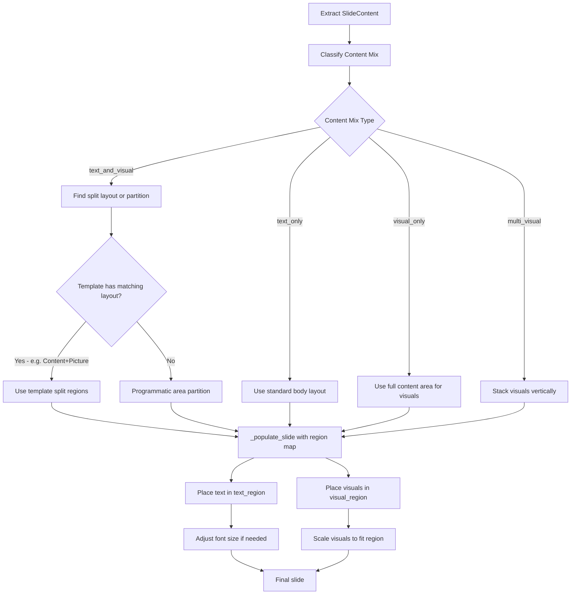
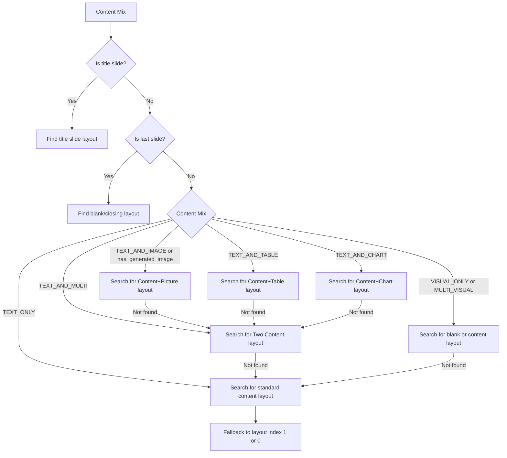
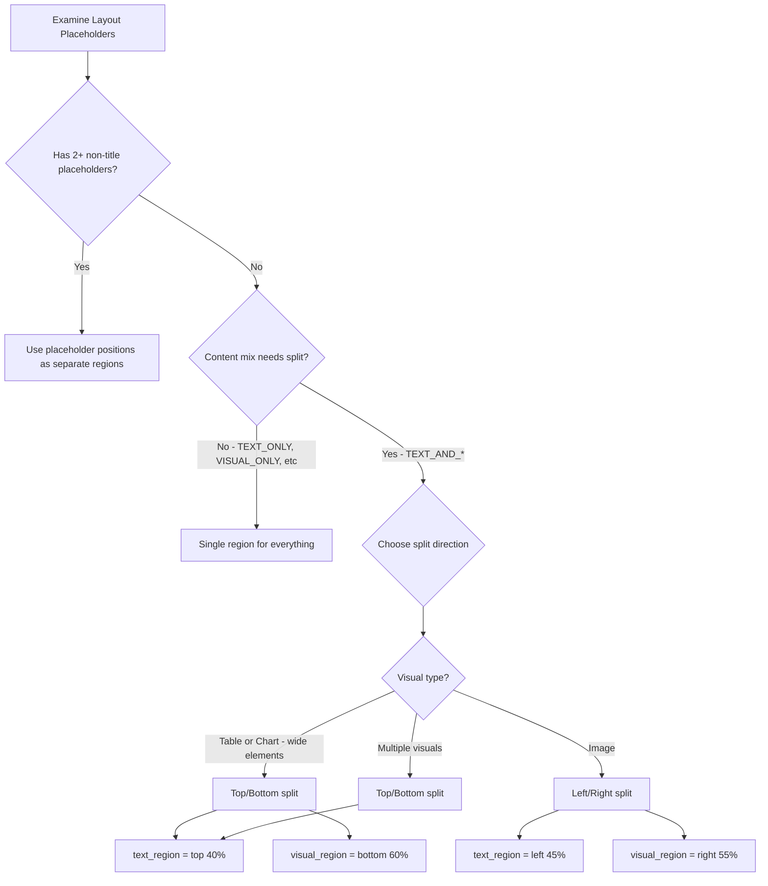

# Layout Collision Resolution System for PowerPoint Slide Assembly

## Problem Summary

In [`powerpoint_template_workflow.py`](../cookbook/90_models/anthropic/skills/powerpoint_template_workflow.py), when slides contain multiple element types (text + images, text + charts/tables, etc.), elements overlap because they are all placed into the same `content_area` without collision awareness.

### Root Cause

[`_populate_slide()`](../cookbook/90_models/anthropic/skills/powerpoint_template_workflow.py:692) places body text into placeholder `idx=1`, then calls [`_transfer_tables()`](../cookbook/90_models/anthropic/skills/powerpoint_template_workflow.py:530), [`_transfer_images()`](../cookbook/90_models/anthropic/skills/powerpoint_template_workflow.py:575), and [`_transfer_charts()`](../cookbook/90_models/anthropic/skills/powerpoint_template_workflow.py:583) — all targeting the same [`content_area`](../cookbook/90_models/anthropic/skills/powerpoint_template_workflow.py:715) derived from the body placeholder position. The body placeholder and visual elements occupy the same physical region.

---

## Architecture Overview



---

## 1. Content Mix Classification

### New Enum: `ContentMix`

Add a classification that describes what element types a slide contains, enabling layout selection and partitioning decisions.

```python
from enum import Enum, auto

class ContentMix(Enum):
    """Classification of element types present on a slide."""
    TEXT_ONLY = auto()        # Only title + body paragraphs
    VISUAL_ONLY = auto()      # Only tables/charts/images, no body text
    TEXT_AND_TABLE = auto()    # Body text + table(s)
    TEXT_AND_CHART = auto()    # Body text + chart(s)
    TEXT_AND_IMAGE = auto()    # Body text + image(s)
    TEXT_AND_MULTI = auto()    # Body text + 2+ visual types
    MULTI_VISUAL = auto()     # Multiple visual types, no body text
    TITLE_ONLY = auto()       # Title slide, no body content
```

### New Function: `_classify_content_mix()`

```python
def _classify_content_mix(content: SlideContent) -> ContentMix:
    """Classify the element mix on a slide to drive layout/partition decisions.

    Args:
        content: Extracted SlideContent from a generated slide.

    Returns:
        ContentMix enum value.
    """
    has_text = bool(content.body_paragraphs) or bool(content.subtitle)
    has_tables = bool(content.tables)
    has_charts = bool(content.charts)
    has_images = bool(content.images)
    
    visual_count = sum([has_tables, has_charts, has_images])
    
    if not has_text and visual_count == 0:
        return ContentMix.TITLE_ONLY
    if has_text and visual_count == 0:
        return ContentMix.TEXT_ONLY
    if not has_text and visual_count >= 1:
        if visual_count > 1:
            return ContentMix.MULTI_VISUAL
        return ContentMix.VISUAL_ONLY
    # has_text AND visual_count >= 1
    if visual_count > 1:
        return ContentMix.TEXT_AND_MULTI
    if has_tables:
        return ContentMix.TEXT_AND_TABLE
    if has_charts:
        return ContentMix.TEXT_AND_CHART
    if has_images:
        return ContentMix.TEXT_AND_IMAGE
    return ContentMix.TEXT_ONLY  # fallback
```

---

## 2. Layout Selection Improvements

### Current Problem

[`_find_best_layout()`](../cookbook/90_models/anthropic/skills/powerpoint_template_workflow.py:354) selects layouts based solely on slide position (first, last, middle). It ignores what content the slide actually has, missing opportunities to use split layouts like "Content + Picture" or "Two Content".

### New Function: `_find_best_layout_v2()`

Replace the current function signature to accept the content mix:

```python
def _find_best_layout(
    template_prs,
    slide_index: int,
    total_slides: int,
    content_mix: ContentMix = ContentMix.TEXT_ONLY,
    has_generated_image: bool = False,
) -> SlideLayout:
```

### Layout Matching Strategy



### Layout Name Keywords

Common PowerPoint template layout names and what they provide:

| Layout Name Pattern | Regions | Best For |
|---|---|---|
| `title slide` | Title + subtitle | Title slides |
| `title and content`, `content` | Title + 1 body area | Text-only slides |
| `two content` | Title + 2 side-by-side areas | Text + any visual |
| `content with caption` | Large area + small caption | Visual-heavy + brief text |
| `picture with caption` | Picture area + caption | Image + brief text |
| `title only` | Title only, rest is open | Visual-only slides |
| `blank` | No placeholders | Full custom placement |
| `comparison` | Title + 2 areas with headers | Side-by-side comparisons |

### Pseudo-code

```python
def _find_best_layout(template_prs, slide_index, total_slides,
                      content_mix=ContentMix.TEXT_ONLY,
                      has_generated_image=False):
    layouts = list(template_prs.slide_layouts)
    if not layouts:
        raise ValueError("Template has no slide layouts")

    layout_names = [(i, layout.name.lower()) for i, layout in enumerate(layouts)]
    is_title_slide = slide_index == 0
    is_last_slide = slide_index == total_slides - 1

    # Title and closing slides: unchanged logic
    if is_title_slide:
        # ... existing title slide logic ...
        pass

    if is_last_slide:
        # ... existing closing slide logic ...
        pass

    # Content-mix-aware selection for body slides
    needs_split = content_mix in (
        ContentMix.TEXT_AND_TABLE,
        ContentMix.TEXT_AND_CHART,
        ContentMix.TEXT_AND_IMAGE,
        ContentMix.TEXT_AND_MULTI,
    ) or has_generated_image

    if needs_split:
        # Priority 1: Layout with picture placeholder (for text+image)
        if content_mix == ContentMix.TEXT_AND_IMAGE or has_generated_image:
            for i, name in layout_names:
                if "picture" in name and ("content" in name or "caption" in name):
                    return layouts[i]

        # Priority 2: "Two Content" layout (splits into left/right regions)
        for i, name in layout_names:
            if "two content" in name or "comparison" in name:
                return layouts[i]

        # Priority 3: "Content with Caption" (large visual + small text)
        for i, name in layout_names:
            if "caption" in name:
                return layouts[i]

    # Visual-only: prefer title-only or blank
    if content_mix in (ContentMix.VISUAL_ONLY, ContentMix.MULTI_VISUAL):
        for i, name in layout_names:
            if "title only" in name:
                return layouts[i]

    # Fallback: standard content layout (existing logic)
    for i, name in layout_names:
        if "content" in name or "body" in name or "text" in name:
            return layouts[i]

    if len(layouts) > 1:
        return layouts[1]
    return layouts[0]
```

---

## 3. Content Area Partitioning Algorithm

### New Dataclass: `RegionMap`

Instead of a single [`ContentArea`](../cookbook/90_models/anthropic/skills/powerpoint_template_workflow.py:162), introduce a `RegionMap` that provides separate regions for text and visuals.

```python
@dataclass
class RegionMap:
    """Defines separate regions for text and visual elements on a slide."""
    text_region: ContentArea | None    # Where body text goes
    visual_region: ContentArea | None  # Where tables/charts/images go
    split_direction: str = "none"      # "none", "left_right", "top_bottom"
```

### New Function: `_compute_region_map()`

This is the core collision-avoidance function. It examines the chosen layout's placeholders and decides how to partition space.

```python
def _compute_region_map(
    layout,
    slide_width: int,
    slide_height: int,
    content_mix: ContentMix,
) -> RegionMap:
    """Compute separate text and visual regions based on layout and content mix.

    Strategy priority:
    1. If layout has distinct placeholder regions (e.g. Two Content),
       use them directly.
    2. If content mix needs splitting but layout only has one content area,
       partition it programmatically (top/bottom or left/right).
    3. If no splitting needed, return the full content area for both.

    Args:
        layout: The chosen slide layout.
        slide_width: Presentation width in EMU.
        slide_height: Presentation height in EMU.
        content_mix: Classification of the slide content.

    Returns:
        RegionMap with text_region and visual_region.
    """
```

### Partitioning Decision Flow



### Pseudo-code

```python
def _compute_region_map(layout, slide_width, slide_height, content_mix):
    # Step 1: Collect all non-title placeholders
    placeholders = []
    for ph in layout.placeholders:
        idx = ph.placeholder_format.idx
        if idx > 0:
            placeholders.append(ph)

    # Step 2: If layout has 2+ non-title placeholders, use them as regions
    if len(placeholders) >= 2:
        # Sort by horizontal position to identify left/right regions
        sorted_phs = sorted(placeholders, key=lambda ph: ph.left)
        left_ph = sorted_phs[0]
        right_ph = sorted_phs[1]

        # Determine which is text vs visual by checking if one is a
        # picture placeholder
        text_ph, visual_ph = left_ph, right_ph
        for ph in [left_ph, right_ph]:
            if _is_picture_placeholder(ph):
                visual_ph = ph
                text_ph = right_ph if ph == left_ph else left_ph
                break

        return RegionMap(
            text_region=ContentArea(
                left=text_ph.left, top=text_ph.top,
                width=text_ph.width, height=text_ph.height,
            ),
            visual_region=ContentArea(
                left=visual_ph.left, top=visual_ph.top,
                width=visual_ph.width, height=visual_ph.height,
            ),
            split_direction="layout_native",
        )

    # Step 3: Single content area — partition programmatically if needed
    base_area = _get_content_area(layout, slide_width, slide_height)

    no_split_needed = content_mix in (
        ContentMix.TEXT_ONLY,
        ContentMix.VISUAL_ONLY,
        ContentMix.MULTI_VISUAL,
        ContentMix.TITLE_ONLY,
    )
    if no_split_needed:
        return RegionMap(
            text_region=base_area,
            visual_region=base_area,
            split_direction="none",
        )

    # Step 4: Programmatic split for text + visual mixes
    GAP = Inches(0.2)  # Gap between regions

    if content_mix in (ContentMix.TEXT_AND_TABLE, ContentMix.TEXT_AND_CHART,
                       ContentMix.TEXT_AND_MULTI):
        # Top/bottom split — text on top, visual on bottom
        # Text gets 35% of the height, visual gets 65%
        text_height_ratio = 0.35
        text_h = int(base_area.height * text_height_ratio)
        visual_h = base_area.height - text_h - GAP

        text_region = ContentArea(
            left=base_area.left,
            top=base_area.top,
            width=base_area.width,
            height=text_h,
        )
        visual_region = ContentArea(
            left=base_area.left,
            top=base_area.top + text_h + GAP,
            width=base_area.width,
            height=visual_h,
        )
        return RegionMap(
            text_region=text_region,
            visual_region=visual_region,
            split_direction="top_bottom",
        )

    if content_mix == ContentMix.TEXT_AND_IMAGE:
        # Left/right split — text on left, image on right
        # Text gets 45% of width, image gets 55%
        text_width_ratio = 0.45
        text_w = int(base_area.width * text_width_ratio)
        visual_w = base_area.width - text_w - GAP

        text_region = ContentArea(
            left=base_area.left,
            top=base_area.top,
            width=text_w,
            height=base_area.height,
        )
        visual_region = ContentArea(
            left=base_area.left + text_w + GAP,
            top=base_area.top,
            width=visual_w,
            height=base_area.height,
        )
        return RegionMap(
            text_region=text_region,
            visual_region=visual_region,
            split_direction="left_right",
        )

    # Default fallback: no split
    return RegionMap(
        text_region=base_area,
        visual_region=base_area,
        split_direction="none",
    )
```

### Split Ratio Guidelines

| Content Mix | Split Direction | Text Ratio | Visual Ratio | Rationale |
|---|---|---|---|---|
| `TEXT_AND_TABLE` | top/bottom | 35% | 65% | Tables are wide, need horizontal space |
| `TEXT_AND_CHART` | top/bottom | 35% | 65% | Charts are wide, need horizontal space |
| `TEXT_AND_IMAGE` | left/right | 45% | 55% | Images benefit from vertical space |
| `TEXT_AND_MULTI` | top/bottom | 30% | 70% | Multiple visuals need more room |

### Adaptive Ratio Adjustment

The split ratios should also adapt to the amount of text:

```python
def _compute_text_ratio(body_paragraphs: list, base_ratio: float) -> float:
    """Adjust the text region ratio based on the amount of text content.

    Short text (1-2 bullets) gets less space.
    Long text (6+ bullets) gets more space.
    """
    num_paragraphs = len(body_paragraphs)
    total_chars = sum(len(text) for text, level in body_paragraphs)

    if num_paragraphs <= 2 and total_chars < 200:
        return base_ratio * 0.7   # Shrink text region
    elif num_paragraphs >= 6 or total_chars > 600:
        return min(base_ratio * 1.3, 0.55)  # Expand text region, cap at 55%

    return base_ratio
```

---

## 4. Updated `_populate_slide()` Integration

### Changes to [`_populate_slide()`](../cookbook/90_models/anthropic/skills/powerpoint_template_workflow.py:692)

The function needs to use `RegionMap` instead of a single `content_area`:

```python
def _populate_slide(
    new_slide,
    content: SlideContent,
    slide_width: int,
    slide_height: int,
    generated_image_bytes: bytes | None = None,
    template_style: TemplateStyle | None = None,
):
    # Step 1: Classify content mix
    content_mix = _classify_content_mix(content)

    # Step 2: Compute region map (replaces single content_area)
    region_map = _compute_region_map(
        new_slide.slide_layout, slide_width, slide_height, content_mix
    )

    populated_indices: set[int] = set()
    title_placed = False
    body_placed = False

    # Step 3: Place text into placeholders (EXISTING LOGIC - unchanged)
    for shape in new_slide.placeholders:
        ph_idx = shape.placeholder_format.idx
        if ph_idx == 0 and content.title:
            _populate_placeholder_with_format(shape, content.title, is_title=True)
            populated_indices.add(ph_idx)
            title_placed = True
        elif ph_idx == 1:
            if content.body_paragraphs:
                # KEY CHANGE: If we have visuals, resize the body placeholder
                # to fit only the text_region
                if region_map.split_direction != "none":
                    _resize_placeholder_to_region(shape, region_map.text_region)
                _populate_placeholder_with_format(
                    shape, content.body_paragraphs, is_title=False,
                    template_style=template_style,
                )
                populated_indices.add(ph_idx)
                body_placed = True
            elif content.subtitle:
                _populate_placeholder_with_format(
                    shape, content.subtitle, is_title=True
                )
                populated_indices.add(ph_idx)
                body_placed = True

    # Step 4: Fallback text boxes use text_region (not full content_area)
    if not title_placed and content.title:
        txBox = new_slide.shapes.add_textbox(
            region_map.text_region.left,  # CHANGED: was content_area.left
            Inches(0.3),
            region_map.text_region.width,  # CHANGED: was content_area.width
            Inches(1.0),
        )
        # ... same formatting logic ...

    if not body_placed and content.body_paragraphs:
        txBox = new_slide.shapes.add_textbox(
            region_map.text_region.left,   # CHANGED
            region_map.text_region.top,    # CHANGED
            region_map.text_region.width,  # CHANGED
            region_map.text_region.height, # CHANGED
        )
        # ... same formatting logic ...

    # Step 5: Place visuals into visual_region (not full content_area)
    _transfer_tables(new_slide, content.tables, region_map.visual_region, template_style=template_style)   # CHANGED: now passes template_style
    _transfer_images(new_slide, content.images, region_map.visual_region)   # CHANGED
    _transfer_charts(new_slide, content.charts, region_map.visual_region, template_style=template_style)   # CHANGED: now passes template_style
    _transfer_shapes(new_slide, content.shapes_xml)

    # Step 6: Generated image insertion (existing logic, unchanged)
    if generated_image_bytes:
        # ... existing picture placeholder detection and insertion ...
        pass

    # Step 7: Cleanup (existing logic, unchanged)
    _clear_unused_placeholders(new_slide, populated_indices)
```

### New Helper: `_resize_placeholder_to_region()`

When we have a body placeholder but need it to only occupy part of the original area:

```python
def _resize_placeholder_to_region(shape, region: ContentArea) -> None:
    """Resize a placeholder shape to fit within a given ContentArea.

    Modifies the shape's position and dimensions in-place.

    Args:
        shape: A placeholder shape from the slide.
        region: Target ContentArea to constrain the placeholder to.
    """
    shape.left = region.left
    shape.top = region.top
    shape.width = region.width
    shape.height = region.height
```

---

## 5. Z-Order Management

### Problem

When elements are placed on a slide, the rendering order depends on their position in the XML shape tree (`spTree`). Elements added later appear on top.

### Strategy

Ensure text is always **on top** of visual elements by controlling insertion order:

```
1. Charts (bottom layer - background visual)
2. Tables (middle layer)
3. Images (middle layer)
4. Shapes XML (preserved position)
5. Text boxes / placeholders (top layer - always readable)
```

### Implementation

The current insertion order in [`_populate_slide()`](../cookbook/90_models/anthropic/skills/powerpoint_template_workflow.py:692) already places text placeholders before visuals (placeholders are populated first at line 723, then transfers happen at lines 793-796). However, **fallback text boxes** (lines 755-791) are added *before* visual transfers — which means they'll be *under* the visuals.

**Fix**: Move fallback text box creation to *after* visual transfers, or explicitly reorder the shape tree after all elements are placed.

```python
def _ensure_text_on_top(slide) -> None:
    """Reorder the shape tree so text elements render above visual elements.

    Moves all shapes that have text frames to the end of the spTree,
    ensuring they render on top of charts, images, and tables.

    Note: Only moves free-floating text boxes, not placeholder shapes
    (which have their own z-order from the layout).
    """
    spTree = slide.shapes._spTree
    text_elements = []

    for shape in list(slide.shapes):
        # Only reorder non-placeholder shapes with text
        if (shape.has_text_frame
            and not shape.is_placeholder
            and shape.shape_type != MSO_SHAPE_TYPE.TABLE):
            text_elements.append(shape._element)

    # Move to end of tree (renders on top)
    for elem in text_elements:
        spTree.remove(elem)
        spTree.append(elem)
```

Add this call at the end of `_populate_slide()`, before `_clear_unused_placeholders()`:

```python
    # Ensure text is visible above visual elements
    _ensure_text_on_top(new_slide)

    _clear_unused_placeholders(new_slide, populated_indices)
```

---

## 6. Font/Size Adjustment Strategy

### When to Adjust

Font size reduction is needed when text doesn't fit in its reduced `text_region`. This happens after a split where the text area is smaller than the original body placeholder.

### Approach

python-pptx already has `fit_text()` and `MSO_AUTO_SIZE.TEXT_TO_FIT_SHAPE`. The current code uses these. The key improvement is to **set appropriate maximum font sizes** based on the available region size.

```python
def _compute_max_font_size(region: ContentArea, num_paragraphs: int) -> int:
    """Compute the maximum font size that allows text to fit a region.

    Uses a heuristic based on available height and paragraph count.

    Args:
        region: The text ContentArea.
        num_paragraphs: Number of text paragraphs to fit.

    Returns:
        Maximum font size in points.
    """
    # Convert EMU to points for height (1 point = 12700 EMU)
    available_height_pt = region.height / 12700

    # Each paragraph needs roughly 1.4x the font size in height (line spacing)
    line_spacing_factor = 1.4
    max_size = int(available_height_pt / (num_paragraphs * line_spacing_factor))

    # Clamp between 10pt and 18pt for body text
    return max(10, min(18, max_size))
```

### Integration

In the body text placement section of `_populate_slide()`:

```python
if not body_placed and content.body_paragraphs:
    max_font = _compute_max_font_size(
        region_map.text_region, len(content.body_paragraphs)
    )
    txBox = new_slide.shapes.add_textbox(
        region_map.text_region.left,
        region_map.text_region.top,
        region_map.text_region.width,
        region_map.text_region.height,
    )
    tf = txBox.text_frame
    tf.word_wrap = True
    for i, (text, level) in enumerate(content.body_paragraphs):
        if i == 0:
            para = tf.paragraphs[0]
        else:
            para = tf.add_paragraph()
        para.text = text
        para.level = level
        para.font.size = Pt(max_font)
    try:
        tf.fit_text(font_family="Calibri", max_size=max_font)
    except Exception:
        tf.auto_size = MSO_AUTO_SIZE.TEXT_TO_FIT_SHAPE
```

### Visual Element Sizing

Tables and charts also need size constraints when placed in a reduced `visual_region`. The existing code already sizes these to the `content_area` parameter — since we now pass `region_map.visual_region` instead, they automatically resize.

For images, [`_fit_to_area()`](../cookbook/90_models/anthropic/skills/powerpoint_template_workflow.py:432) already handles aspect-ratio-preserving scaling within the given area.

---

## 7. Updated Call Site in Template Application

### Changes to the [template application loop](../cookbook/90_models/anthropic/skills/powerpoint_template_workflow.py:1634)

**Template style extraction** is now called once at the start of Step 4, before the per-slide loop. The extracted `template_style` is then passed through the chain: `step_assemble_template()` → `_populate_slide()` → `_transfer_tables()` / `_transfer_charts()` / `_populate_placeholder_with_format()`.

```python
# NEW: Extract template styles once at the start of Step 4
template_style = _extract_template_styles(output_prs)

for idx, gen_slide in enumerate(generated_slides):
    content = _extract_slide_content(gen_slide)
    gen_img = generated_images.get(idx) or generated_images.get(str(idx))

    # NEW: Classify content mix BEFORE layout selection
    content_mix = _classify_content_mix(content)

    # CHANGED: Pass content_mix to layout selection
    layout = _find_best_layout(
        output_prs, idx, total_slides,
        content_mix=content_mix,
        has_generated_image=gen_img is not None,
    )

    # ... existing picture placeholder detection ...

    # Only add as free-floating picture if no picture placeholder
    if gen_img is not None and not content.has_image_placeholder:
        content.images.append(ImageData(...))

    new_slide = output_prs.slides.add_slide(layout)
    # CHANGED: Now passes template_style for style-aware rendering
    _populate_slide(
        new_slide, content, slide_width, slide_height,
        generated_image_bytes=gen_img,
        template_style=template_style,
    )
```

---

## 8. Complete Function Signatures and Data Flow

### New Functions Summary

| Function | Location | Purpose |
|---|---|---|
| `_classify_content_mix(content) -> ContentMix` | After `ContentArea` class | Classify element mix on a slide |
| `_compute_region_map(layout, w, h, mix) -> RegionMap` | After `_get_content_area()` | Compute text/visual split regions |
| `_resize_placeholder_to_region(shape, region)` | Before `_populate_slide()` | Resize a placeholder to fit a region |
| `_compute_text_ratio(paragraphs, base) -> float` | Internal to `_compute_region_map()` | Adapt split ratio to text volume |
| `_compute_max_font_size(region, n_paras) -> int` | Before `_populate_slide()` | Compute max font size for region |
| `_ensure_text_on_top(slide)` | Before `_clear_unused_placeholders()` | Reorder z-order for text visibility |
| `_is_picture_placeholder(ph) -> bool` | Utility | Extract existing picture-ph detection into reusable helper |

### Modified Functions

| Function | Change |
|---|---|
| `_find_best_layout()` | Add `content_mix` and `has_generated_image` parameters |
| `_populate_slide()` | Use `RegionMap` instead of single `content_area`; resize placeholders; reorder z-order. Now also accepts `template_style: TemplateStyle \| None = None` and passes it to downstream functions for style-aware rendering. |
| `_transfer_tables()` | Now also accepts `template_style: TemplateStyle \| None = None`. When provided, calls `_apply_table_style()` to apply reference table styling (fonts, fills, borders, raw `tblPr` XML). |
| `_transfer_charts()` | Now also accepts `template_style: TemplateStyle \| None = None`. When provided, calls `_apply_chart_style()` to apply reference chart styling (series colors, axis/legend fonts, plot area fill). |
| `_populate_placeholder_with_format()` | Now also accepts `template_style: TemplateStyle \| None = None`. When provided, uses theme font names for `fit_text()` instead of hardcoded defaults. |
| Template application loop (line 1634) | Classify content mix before layout selection. `_extract_template_styles()` is now called at the start of Step 4 and `template_style` is threaded through to `_populate_slide()`. |

### Data Flow Diagram

```mermaid
sequenceDiagram
    participant Loop as Template Loop
    participant Extract as _extract_slide_content
    participant Classify as _classify_content_mix
    participant Layout as _find_best_layout
    participant Region as _compute_region_map
    participant Populate as _populate_slide
    participant Transfer as _transfer_* functions

    Loop->>Extract: gen_slide
    Extract-->>Loop: SlideContent
    Loop->>Classify: SlideContent
    Classify-->>Loop: ContentMix
    Loop->>Layout: template_prs, idx, total, ContentMix
    Layout-->>Loop: best layout
    Loop->>Populate: new_slide, content, dimensions, image_bytes
    Populate->>Classify: content (internal)
    Populate->>Region: layout, dimensions, ContentMix
    Region-->>Populate: RegionMap with text_region + visual_region
    Populate->>Populate: Place text in text_region
    Populate->>Transfer: tables/images/charts + visual_region
    Populate->>Populate: _ensure_text_on_top
    Populate->>Populate: _clear_unused_placeholders
```

---

## 9. Edge Cases and Fallbacks

### Edge Case: Layout Has No Usable Placeholders

If the template only has a blank layout, `_compute_region_map()` falls back to default margins (existing behavior in `_get_content_area()`) and applies programmatic splitting.

### Edge Case: Generated Image + Body Text + Table

This is a `TEXT_AND_MULTI` scenario. The region map gives text 30% height at top, and visuals 70% at bottom. The generated image goes into a picture placeholder if available (handled separately), or into the visual region alongside the table.

### Edge Case: Very Long Text With Small Visual

`_compute_text_ratio()` adjusts the split to give text more space (up to 55%), preventing tiny unreadable text.

### Edge Case: Subtitle-Only Slides (Title + Subtitle)

Classified as `TITLE_ONLY` — no splitting needed. Subtitle goes into placeholder idx=1 or a fallback textbox.

### Edge Case: Shapes XML Positioning

[`_transfer_shapes()`](../cookbook/90_models/anthropic/skills/powerpoint_template_workflow.py:632) copies shape XML with original absolute positions. These are NOT region-aware and could still overlap. This is acceptable because shapes are typically decorative elements with intentional positioning.

---

## 10. Implementation Checklist

These are the ordered implementation steps:

1. Add `ContentMix` enum and `RegionMap` dataclass after the existing [`ContentArea`](../cookbook/90_models/anthropic/skills/powerpoint_template_workflow.py:162) class
2. Add `_classify_content_mix()` function
3. Add `_is_picture_placeholder()` helper (extract from existing repeated logic)
4. Add `_compute_text_ratio()` helper
5. Add `_compute_region_map()` function after [`_get_content_area()`](../cookbook/90_models/anthropic/skills/powerpoint_template_workflow.py:393)
6. Add `_resize_placeholder_to_region()` helper
7. Add `_compute_max_font_size()` helper
8. Add `_ensure_text_on_top()` function
9. Modify [`_find_best_layout()`](../cookbook/90_models/anthropic/skills/powerpoint_template_workflow.py:354) to accept and use `content_mix` parameter
10. Modify [`_populate_slide()`](../cookbook/90_models/anthropic/skills/powerpoint_template_workflow.py:692) to use `RegionMap` for text/visual placement
11. Modify [template application loop](../cookbook/90_models/anthropic/skills/powerpoint_template_workflow.py:1634) to classify content before layout selection
12. Test with multi-element slides: text+table, text+chart, text+image, text+multi
