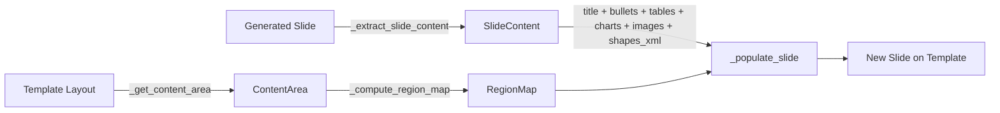
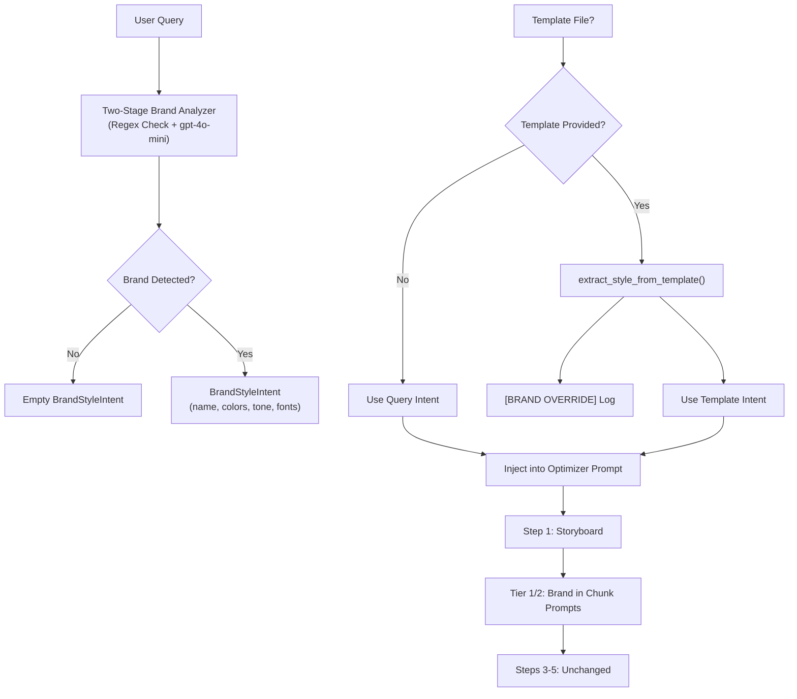

# Architecture: PowerPoint Workflow Suite

**Files:**
- `cookbook/90_models/anthropic/skills/powerpoint_workflow_demo/powerpoint_template_workflow.py` — Single-call pipeline (up to ~7 slides)
- `cookbook/90_models/anthropic/skills/powerpoint_workflow_demo/powerpoint_chunked_workflow.py` — Chunked pipeline for large presentations (8-15+ slides)

**Date:** 2026-02-25
**Last Updated:** 2026-03-04
**Pattern:** Sequential Agno Workflow with mixed agent steps and executor functions

---

## Two Complementary Approaches

This cookbook provides **two workflow files** that solve the same problem (AI-generated PowerPoint presentations) at different scales:

| Aspect | `powerpoint_template_workflow.py` | `powerpoint_chunked_workflow.py` |
|--------|----------------------------------|----------------------------------|
| **Best for** | Short decks (up to ~7 slides) | Large decks (8-15+ slides) |
| **Approach** | Single Claude API call for all content | Splits into N-slide chunks, merges result |
| **Template** | Required | Optional |
| **Visual review** | Optional (`--visual-review`) | Optional (`--visual-review`, template required) |
| **Step count** | 4 steps (+ optional Step 5) | 2-5 steps depending on flags |
| **Storyboard planning** | No — direct generation | Yes — query optimizer plans all slides first |

### Relationship Between the Files

```
powerpoint_template_workflow.py
  │
  │  Provides (via wildcard import *):
  │    - All Pydantic models (SlideImageDecision, ImagePlan, ShapeIssue, etc.)
  │    - All dataclasses (SlideContent, ContentArea, RegionMap, etc.)
  │    - All helper functions (_extract_slide_content, _populate_slide, etc.)
  │    - All agents (image_planner, slide_quality_reviewer)
  │    - All step functions (step_generate_images, step_assemble_template,
  │                          step_visual_quality_review)
  │    - VERBOSE module-level flag
  │
  └──► powerpoint_chunked_workflow.py
         Adds on top:
           - BrandStyleIntent Pydantic model
           - StoryboardPlan / SlideStoryboard Pydantic models
           - agents/ package (dynamically provides brand_style_analyzer, query_optimizer, etc.)
           - parse_brand_style_intent() / extract_style_from_template()
           - _format_brand_context_for_prompt() / _build_brand_override_log()
           - generate_chunk_pptx() helper
           - step_optimize_and_plan()
           - step_generate_chunks()
           - step_process_chunks()    (calls step_generate_images + step_assemble_template)
           - step_visual_review_chunks()  (calls step_visual_quality_review per chunk)
           - merge_pptx_files() + _clone_slide()
           - step_merge_chunks()
           - build_chunked_workflow()
```

**Key rule:** Do NOT add chunking logic to `powerpoint_template_workflow.py`. Keep them separate. The template workflow is self-contained for short decks; the chunked workflow wraps it for large decks.

---

## Chunked Workflow: Pipeline Modes

The chunked workflow supports two distinct modes depending on whether `--template` is passed:

### Mode A: Raw Generation (no `--template`)

```
User prompt
    │
    ▼
Step 1: Optimize & Plan
    │  (claude-sonnet-4-6 → StoryboardPlan)
    ▼
Step 2: Generate Chunks
    │  (Claude pptx skill, N chunks)
    ▼
Step 5: Merge Chunks
    │  (raw chunk_files → merged PPTX)
    ▼
Final PPTX
```

- `--visual-review` and `--visual-passes` are **completely ignored** even if passed
- Step 3 (Process Chunks) is **skipped**
- Step 4 (Visual Review) is **skipped**
- Interim chunk PPTX files are **preserved** in `output_chunked/chunked_workflow_work/`

### Mode B: Template-Assisted Generation (`--template` provided)

```
User prompt + Template
    │
    ▼
Step 1: Optimize & Plan
    │  (claude-sonnet-4-6 → StoryboardPlan)
    ▼
Step 2: Generate Chunks
    │  (Claude pptx skill, N chunks)
    ▼
Step 3: Process Chunks
    │  (image planning + image generation + template assembly per chunk)
    ▼
[Step 4: Visual Review]   ← only if --visual-review is also passed
    │  (Gemini vision QA per chunk, up to --visual-passes passes with upfront key validation)
    ▼
Step 5: Merge Chunks
    │  (processed/reviewed chunks → merged PPTX)
    ▼
Final PPTX
```

### Step Source Selection in `step_merge_chunks()`

| Mode | `has_template` | `visual_review` | Source used |
|------|---------------|-----------------|-------------|
| Raw (no template) | False | — | `chunk_files` (raw Claude output) |
| Template, no visual review | True | False | `processed_chunks` |
| Template + visual review | True | True | `reviewed_chunks` |

### Enforced Guard in `main()`

```python
# Effective values — visual review/passes are forced off when no template
effective_visual_review = bool(args.visual_review) and bool(args.template)
effective_visual_passes = args.visual_passes if args.template else 0

# Warnings printed if flags are passed but ignored
if not args.template and args.visual_review:
    print("[WARNING] --visual-review is ignored when --template is not provided")
if not args.template and args.visual_passes != 3:
    print("[WARNING] --visual-passes is ignored when --template is not provided")
```

---

## Overview

This cookbook implements pipeline(s) (4–5 steps for the single-file workflow; 2–5 steps for the chunked workflow) that generate professional PowerPoint presentations by combining AI content generation, AI image creation, and deterministic template assembly.

The architecture separates concerns into distinct workflow steps:
1. An LLM generates raw slide content
2. A second LLM plans which slides need images
3. An image generation model creates visuals
4. A deterministic function assembles everything onto the template
5. *(Optional)* A vision model inspects rendered slides and applies safe corrections

---

## How It Works (Visual Overview)

This pipeline turns a simple text prompt into a polished PowerPoint presentation in 4–5 automated steps:

```
                    ┌─────────────────┐
                    │   YOUR INPUTS   │
                    │                 │
                    │  Text Prompt    │
                    │  + Template     │
                    └────────┬────────┘
                             │
                             ▼
        ┌────────────────────────────────────────┐
          Brand Parse    Storyboard    Chunk Generation
         (gpt-4o-mini)  (Sonnet+web)   (3-tier fallback)
               │              │              │
        │  Agent: Claude (Anthropic)              │
        │  Role:  Writes the presentation         │
        │         content — titles, bullets,      │
        │         tables, and charts              │
        │                                        │
        │  Output: Raw .pptx file with content   │
        └────────────────────┬───────────────────┘
                             │
                             ▼
        ┌────────────────────────────────────────┐
        │  STEP 2: Image Planning                │
        │                                        │
        │  Agent: Gemini (Google)                 │
        │  Role:  Reviews each slide and decides  │
        │         which ones need images          │
        │                                        │
        │  Output: Image plan (yes/no per slide) │
        └────────────────────┬───────────────────┘
                             │
                             ▼
        ┌────────────────────────────────────────┐
        │  STEP 3: Image Generation              │
        │                                        │
        │  Tool: NanoBanana (Gemini Image Gen)    │
        │  Role:  Creates AI-generated images     │
        │         for the slides that need them   │
        │                                        │
        │  Output: PNG images for selected slides │
        └────────────────────┬───────────────────┘
                             │
                             ▼
        ┌────────────────────────────────────────┐
        │  STEP 4: Template Assembly             │
        │                                        │
        │  Engine: Deterministic (no AI)          │
        │  Role:  FIRST builds a comprehensive    │
        │         knowledge file from: the user   │
        │         prompt, the full content plan,  │
        │         a deep per-layout analysis of   │
        │         the template design language,   │
        │         and all AI image assets.        │
        │         THEN maps all content + images  │
        │         onto the template using that    │
        │         knowledge file as the single    │
        │         source of truth.                │
        │                                        │
        │  Output: Final polished .pptx file     │
        └────────────────────┬───────────────────┘
                             │
                             ▼
        ┌────────────────────────────────────────┐
        │  STEP 5: Visual Quality Review         │
        │  (Optional — requires --visual-review  │
        │   and LibreOffice)                     │
        │                                        │
        │  Agent: Gemini 2.5 Flash (vision)       │
        │  Role:  Renders each slide to PNG,      │
        │         detects defects, applies safe   │
        │         corrections to critical issues  │
        │                                        │
        │  Output: Corrected .pptx + QA report   │
        └────────────────────┬───────────────────┘
                             │
                             ▼
                    ┌─────────────────┐
                    │   YOUR OUTPUT   │
                    │                 │
                    │  Professional   │
                    │  Presentation   │
                    │  (.pptx file)   │
                    └─────────────────┘
```

### Key Actors

| Step | Who Does the Work | What They Do | AI or Code? |
|------|-------------------|--------------|-------------|
| 1 | **Claude** (Anthropic) | Writes all slide content from your prompt | AI Agent |
| 2 | **Gemini** (Google) | Decides which slides benefit from images | AI Agent |
| 3 | **NanoBanana** (Gemini) | Generates professional images for slides | AI Tool |
| 4 | **Template Engine** | Builds comprehensive knowledge file first (user intent + content plan + deep template design analysis + image assets), then applies your company's template styling using that as the single source of truth | Deterministic Code |
| 5 *(opt)* | **Gemini 2.5 Flash** (vision) | Inspects rendered slides, corrects critical defects | AI Agent + Deterministic Code |

### What You Control (`powerpoint_template_workflow.py`)

| Option | What It Does | Default |
|--------|-------------|---------|
| `--template` / `-t` | Your company's .pptx template | None (optional) |
| `--prompt` / `-p` | What the presentation should be about | Built-in demo |
| `--output` / `-o` | Where to save the result | `presentation_from_template.pptx` |
| `--llm-provider` | LLM provider for swappable agents (claude, openai, gemini) | `claude` |
| `--no-images` | Skip Steps 2 and 3 (faster, text-only) | Images enabled |
| `--no-stream` | Use simpler API mode (more reliable for short prompts) | Streaming enabled |
| `--visual-review` | Enable Step 5 visual QA (requires LibreOffice) | Off |
| `--footer-text` | Footer text applied to all slides | Empty (remove footer) |
| `--date-text` | Date text for footer date placeholder | Empty (remove) |
| `--show-slide-numbers` | Keep slide number placeholders | Off |
| `--verbose` / `-v` | Show detailed diagnostic output | Off |

### What You Control (`powerpoint_chunked_workflow.py`)

| Option | What It Does | Default | Notes |
|--------|-------------|---------|-------|
| `--template` / `-t` | .pptx template (optional) | None | Without it: raw generation mode |
| `--prompt` / `-p` | Presentation topic | Built-in demo | |
| `--output` / `-o` | Output filename | `presentation_chunked.pptx` | |
| `--chunk-size` | Slides per Claude API call | 3 | Tune for quality vs. speed |
| `--llm-provider`| LLM provider (claude, openai, gemini) | `claude` | Content gen remains fixed to Claude |
| `--max-retries` | Retries per chunk on failure | 2 | |
| `--no-images` | Skip image generation | Off | Only applies when `--template` is set |
| `--visual-review` | Enable per-chunk visual QA | Off | **Ignored** when `--template` is not set |
| `--visual-passes` | Max visual QA passes per chunk | 3 | **Ignored** when `--template` is not set |
| `--footer-text` | Footer text for all slides | Empty | Only applies when `--template` is set |
| `--date-text` | Date text for footer | Empty | Only applies when `--template` is set |
| `--show-slide-numbers` | Keep slide number placeholders | Off | Only applies when `--template` is set |
| `--start-tier` | Starting tier for chunk generation | 1 | 1=Claude PPTX skill (opus), 2=LLM code gen (haiku), 3=text-only |
| `--verbose` / `-v` | Verbose/debug logging | Off | |
| `--inter-chunk-delay-min` | Minimum random delay between chunks | 60 | |
| `--inter-chunk-delay-max` | Maximum random delay between chunks | 120 | |
| `--no-web-search` | Disable web search | Off | |

### Quick Example

```bash
# Generate a presentation about AI trends using your company template
python cookbook/90_models/anthropic/skills/powerpoint_workflow_demo_v2/powerpoint_chunked_workflow.py \
    --template templates/company_template.pptx \
    --prompt "Create a 10-slide presentation about AI trends in 2026" \
    --output ai_trends.pptx

# Same with visual QA + footer
python cookbook/90_models/anthropic/skills/powerpoint_workflow_demo_v2/powerpoint_chunked_workflow.py \
    --template templates/company_template.pptx \
    --prompt "Create a 10-slide presentation about AI trends in 2026" \
    --output ai_trends.pptx \
    --visual-review \
    --footer-text "Confidential" --show-slide-numbers
```

---

## Dependencies

| Package | Purpose |
|---------|---------|
| `agno` | Agent, Workflow, Step, Model wrappers (Claude, OpenAIResponses, Gemini) |
| `anthropic` | Anthropic API client for downloading skill-generated files |
| `openai` | OpenAI API client for GPT models |
| `python-pptx` | Presentation reading/writing, shapes, charts, placeholders |
| `lxml` | XML manipulation for removing template slides and shape ID management |
| `pydantic` | Structured output schemas for image planning and visual QA |
| `pillow` | Required by NanoBananaTools for image handling |

**System dependencies:**
- `LibreOffice` — required for Step 5 visual quality review (headless PPTX→PDF conversion). Install: `apt-get install libreoffice`.
- `poppler-utils` — required for per-slide PNG rendering (PDF→PNG via `pdftoppm`). Install: `apt-get install poppler-utils`. Without it, rendering falls back to single-slide mode with a warning.

The visual review step is fully non-blocking and skips gracefully if either dependency is missing.

**Local dependency:**
- [`file_download_helper.py`](file_download_helper.py) — Downloads files produced by Claude's `pptx` skill via the Anthropic Files API. Detects file type from magic bytes and saves to disk.

---

## Data Models

### Pydantic Models — Structured Agent Output

| Model | Purpose | Used In |
|-------|---------|---------|
| [`SlideImageDecision`](powerpoint_template_workflow.py) | Per-slide decision: needs image? prompt? reasoning? | Step 2 output |
| [`ImagePlan`](powerpoint_template_workflow.py) | List of `SlideImageDecision` for all slides | Step 2 `output_schema` |
| [`ShapeIssue`](powerpoint_template_workflow.py) | Single visual defect on a slide: `issue_type`, `severity`, `description`, `programmatic_fix`, `shape_description` | Step 5 nested output |
| [`SlideQualityReport`](powerpoint_template_workflow.py) | Per-slide quality report: `overall_quality`, `is_visually_bland`, `issues` | Step 5 `output_schema` per slide |
| [`PresentationQualityReport`](powerpoint_template_workflow.py) | Full-deck quality summary: `slide_reports`, `overall_pass`, `total_critical_issues`, `recommendations` | Stored in `session_state["quality_report"]` |
| [`BrandStyleIntent`](powerpoint_chunked_workflow.py) | Structured brand/style data: `has_branding`, `brand_name`, `style_keywords`, `color_palette`, `tone_override`, `typography_hints`, `content_query`, `source` ("query" or "template"), `source_detail` | Stored in `session_state["brand_style_intent"]`, injected into optimizer/chunk prompts |

### Dataclasses — Internal Content Representation

| Dataclass | Purpose | Fields |
|-----------|---------|--------|
| [`TableData`](powerpoint_template_workflow.py) | Extracted table with position | `rows`, `left`, `top`, `width`, `height` |
| [`ImageData`](powerpoint_template_workflow.py) | Extracted image blob with position | `blob`, `left`, `top`, `width`, `height`, `content_type` |
| [`ChartExtract`](powerpoint_template_workflow.py) | Extracted chart data with position | `chart_type`, `categories`, `series`, `left`, `top`, `width`, `height` |
| [`SlideContent`](powerpoint_template_workflow.py) | All content from one slide | `title`, `subtitle`, `body_paragraphs`, `tables`, `images`, `charts`, `shapes_xml`, `text_shapes_xml` |
| [`ContentArea`](powerpoint_template_workflow.py) | Safe content region on a template slide in EMU | `left`, `top`, `width`, `height` |
| [`RegionMap`](powerpoint_template_workflow.py) | Separate text and visual regions for a slide | `text_region`, `visual_region`, `layout_type` |

### Dataclasses — Template Style Extraction

| Dataclass | Purpose | Fields |
|-----------|---------|--------|
| [`TemplateTheme`](powerpoint_template_workflow.py) | Theme colors and fonts from the template's slide master | `accent_colors` (up to 6), `dk1`, `dk2`, `lt1`, `lt2`, `hlink`, `folHlink`, `major_font`, `minor_font` |
| [`TemplateTableStyle`](powerpoint_template_workflow.py) | Table styling extracted from reference tables in the template | `header_font_size`, `header_font_color`, `header_font_family`, `header_fill`, `cell_font_size`, `cell_font_color`, `cell_font_family`, `cell_fill`, `border_color`, `raw_tblPr_xml` |
| [`TemplateChartStyle`](powerpoint_template_workflow.py) | Chart styling extracted from reference charts in the template | `series_fill_colors`, `series_line_colors`, `axis_font_size`, `axis_font_family`, `legend_font_size`, `legend_font_family`, `data_label_font_size`, `plot_area_fill` |
| [`TemplateStyle`](powerpoint_template_workflow.py) | Composite container for all extracted template styling | `theme` (`TemplateTheme`), `table_style` (`TemplateTableStyle`), `chart_style` (`TemplateChartStyle`), `body_font_size`, `title_font_size` |

**Data flow through the pipeline:**



---

## Step-by-Step Architecture

### Step 1: Content Generation

**Type:** Executor function
**Function:** [`step_generate_content()`](powerpoint_template_workflow.py)
**Agent:** Claude `claude-opus-4-6` (with `context-1m-2025-08-07` beta) with `pptx` skill

**Flow:**
1. Reads the template to extract available layout names
2. Builds an enhanced prompt with structural requirements for template compatibility
3. Creates a Claude `Agent` with the `pptx` skill and formatting instructions
4. Runs the agent (streaming or non-streaming based on `--no-stream` flag), which generates a `.pptx` file server-side
5. Downloads the generated file via [`download_skill_files()`](file_download_helper.py) using the Anthropic Files API
6. Validates the download is a valid `.pptx` file
7. Opens the generated presentation and:
   - **Stores source slide dimensions** (`src_slide_width`, `src_slide_height`) for shape rescaling in Step 4
   - Extracts [`SlideContent`](powerpoint_template_workflow.py) from each slide using [`_extract_slide_content()`](powerpoint_template_workflow.py)
8. Stores extracted data in `session_state` for downstream steps:
   - `generated_file`: path to the downloaded `.pptx`
   - `slides_data`: list of slide metadata dicts
   - `total_slides`: count
   - `src_slide_width` / `src_slide_height`: source EMU dimensions for shape rescaling

**Agent instructions** enforce:
- One clear title per slide
- 4-6 concise bullet points
- Tables limited to 6 rows x 5 columns
- No custom fonts, colors, SmartArt, or animations
- Standard slide ordering: Title, Content, Closing

**Streaming modes:**
- **Streaming (default):** Required for long-running skill operations (>10 min) but may have issues with `provider_data` propagation.
- **Non-streaming (`--no-stream`):** Simpler and more reliable for shorter operations but can timeout on complex presentations.

### Step 2: Image Planning

**Type:** Executor function
**Function:** [`step_plan_images()`](powerpoint_template_workflow.py) — wraps [`image_planner`](powerpoint_template_workflow.py) agent
**Agent (internal):** Gemini `gemini-3-flash-preview` with `output_schema=ImagePlan`

**Flow:**
1. Receives the JSON summary of slides from Step 1 as input
2. Uses Gemini with structured output to decide per-slide whether an image is needed
3. Outputs an [`ImagePlan`](powerpoint_template_workflow.py) with a list of [`SlideImageDecision`](powerpoint_template_workflow.py)s

**Decision guidelines** encoded in agent instructions:
- Title slides: usually YES
- Data slides with tables/charts: usually NO
- Slides with existing images: ALWAYS NO
- Closing slides: usually NO

### Step 3: Image Generation

**Type:** Executor function
**Function:** [`step_generate_images()`](powerpoint_template_workflow.py)
**Tool:** `NanoBananaTools` with `aspect_ratio="16:9"`

**Flow:**
1. Parses the `ImagePlan` from Step 2
2. Filters out slides that already have images from Claude
3. For each slide needing an image, calls `nano_banana.create_image()` with the prompt
4. Stores generated PNG bytes in `session_state["generated_images"]` keyed by slide index

**Resilience:** Gracefully handles missing `GOOGLE_API_KEY`, unparseable plans, and individual image generation failures without stopping the workflow.

### Step 4: Template Assembly

**Type:** Executor function
**Function:** [`step_assemble_template()`](powerpoint_template_workflow.py)

This is the most critical and knowledge-intensive step in the pipeline. Before constructing any slide, it first consolidates all necessary context into a comprehensive knowledge file that acts as the single source of truth for every design and content decision made during file generation.

**Flow:**
1. Copies the template file to the output path
2. Opens the copy as the output presentation
3. **Extracts template styles** via [`_extract_template_styles()`](powerpoint_template_workflow.py) — parses theme colors/fonts and scans reference visual elements (tables, charts) for their styling
4. **Builds the assembly knowledge file** (single source of truth) — calls:
   a. [`_analyze_template_in_depth()`](powerpoint_template_workflow.py) — deep per-layout analysis: every placeholder's position, font, color, bold; every decorative shape's fill/line/position; full accent palette; recurring motif colors; design language summary
   b. [`_build_assembly_knowledge_file()`](powerpoint_template_workflow.py) — consolidates all four mandatory inputs: original user prompt, complete content plan from Step 1, template deep analysis, and all AI image assets (with pixel dimensions) into one dict stored in `session_state["assembly_knowledge"]`
5. Removes all existing slides from the template copy using `lxml` XML manipulation
6. For each generated slide:
   a. Extracts content via [`_extract_slide_content()`](powerpoint_template_workflow.py)
   b. Appends any AI-generated image from `session_state` as an [`ImageData`](powerpoint_template_workflow.py)
   c. Selects the best template layout via [`_find_best_layout()`](powerpoint_template_workflow.py)
   d. Creates a new slide from the selected layout
   e. Populates the slide via [`_populate_slide()`](powerpoint_template_workflow.py), passing:
      - `template_style` for style-aware content rendering
      - `src_slide_width` / `src_slide_height` for shape coordinate rescaling
      - `footer_text`, `date_text`, `show_slide_number` for footer standardization
7. Saves the final presentation

### Step 5: Visual Quality Review (Optional)

**Type:** Executor function
**Function:** [`step_visual_quality_review()`](powerpoint_template_workflow.py)
**Agent:** [`slide_quality_reviewer`](powerpoint_template_workflow.py) — Gemini 2.5 Flash with `output_schema=SlideQualityReport`
**Enabled by:** `--visual-review` CLI flag
**System requirements:** LibreOffice (`apt-get install libreoffice`) + `poppler-utils` (`apt-get install poppler-utils`)

**This step is fully non-blocking.** Any failure (LibreOffice not found, API error, timeout) returns `success=True` with a warning and leaves the output file unchanged.

**Flow:**
1. **Render** — Calls [`_render_pptx_to_images()`](powerpoint_template_workflow.py) to render all slides to per-slide PNGs using the PPTX→PDF→PNG pipeline: LibreOffice converts to PDF, then `pdftoppm` (poppler) renders each page as a separate PNG at 150 DPI. Falls back to single-image LibreOffice direct conversion if `pdftoppm` is unavailable.
2. **Inspect** — For each slide PNG, sends it to `slide_quality_reviewer` (Gemini 2.5 Flash) and receives a `SlideQualityReport` with detected issues and severity ratings.
3. **Correct** — Calls [`_apply_visual_corrections()`](powerpoint_template_workflow.py) for slides with `critical`-severity issues. Corrections re-invoke existing deterministic functions only (no new correction logic).
4. **Warn** — Logs blandness warnings for slides flagged as `is_visually_bland=True` without auto-fixing them (user should re-run with `--min-images`).
5. **Report** — Stores [`PresentationQualityReport`](powerpoint_template_workflow.py) in `session_state["quality_report"]`.

**Correction scope in v1:**

| Issue type | Programmatic fix | How it's applied |
|---|---|---|
| `low_contrast` | `increase_contrast` | Re-runs `_ensure_text_contrast()` |
| `ghost_text`, `empty_placeholder` | `clear_placeholder` / `remove_element` | Re-runs `_clear_unused_placeholders()` + `_remove_empty_textboxes()` |
| `text_overflow` | `reduce_font_size` | Conservative 15% reduction on `rPr.sz` attributes above Pt(10) |
| Visual blandness | (detect + warn only) | Not auto-fixed; logged with `--min-images` recommendation |
| `overlap` with `reposition_element` | (not implemented in v1) | Deferred — reliable shape identification requires bounding-box matching |

### Phase 3: Template Quality Safeguards

Five safeguards added in March 2026 to prevent styling failures specific to template-assisted generation. These work together as a defense-in-depth chain:

```
Fix 5: Template-aware prompts  →  LLM generates compatible content from the start
     ↓ (if content still mismatches)
Fix 3: Font size guard         →  Prevents unreadable text after fit_text()
Fix 4: Overlap reflow          →  Resolves shape collisions after transfer
Fix 2: Background detection    →  Ensures correct contrast decisions
Fix 1: Per-slide rendering     →  Visual review sees ALL slides to catch remaining issues
```

| Safeguard | Layer | Function | Trigger |
|-----------|-------|----------|--------|
| Template-aware prompts | Prompt (preventive) | `generate_chunk_pptx_v2()` | Tier 2 LLM code gen with `--template` |
| Min font size | Assembly (corrective) | `_populate_placeholder_with_format()`, `_populate_slide()` | After `fit_text()` shrinks below 10pt/14pt |
| Overlap reflow | Assembly (corrective) | `_fix_overlapping_shapes()` | After `_transfer_shapes()` |
| Background detection | Contrast (corrective) | `_get_shape_background_color()` | During `_ensure_text_contrast()` |
| Per-slide rendering | QA (detective) | `_render_pptx_to_images()` | During `--visual-review` step |

See [`DESIGN_visual_quality.md`](DESIGN_visual_quality.md) → Phase 3 for technical deep-dives, root cause analysis, and implementation trade-offs.

---

## Template Deep Analysis & Assembly Knowledge File

These functions implement the Step 4 prerequisite: building the comprehensive knowledge file before any PPTX slide is constructed. They are located in the source between the "Template Style Application Functions" section and the Step 4 executor.

| Function | Purpose |
|----------|---------|
| [`_extract_shape_design_info(shape)`](powerpoint_template_workflow.py) | Low-level helper. Extracts fill color, line color/width, position, and size from any non-placeholder (decorative) shape element via direct XML traversal. Returns a plain `dict`. |
| [`_analyze_template_in_depth(template_prs)`](powerpoint_template_workflow.py) | Thorough per-layout analysis of the template's complete design language. Returns a structured `dict` with five top-level keys: `slide_dimensions` (EMU + inches + aspect ratio), `theme` (full accent palette, dk1/dk2/lt1/lt2, major/minor fonts), `master_analysis` (background color + all decorative shapes), `layouts` (for every layout: name, background, per-placeholder typography + position %, all decorative shapes), `design_language_summary` (primary/secondary accent, full palette, heading/body fonts, typical font sizes, typography ratio, total layouts, recurring motif colors). |
| [`_knowledge_json_default(obj)`](powerpoint_template_workflow.py) | JSON serialization fallback for bytes and other non-serializable types in the knowledge file. |
| [`_build_assembly_knowledge_file(session_state, template_analysis)`](powerpoint_template_workflow.py) | Consolidates all four mandatory pipeline inputs into one `dict` before any slide construction begins. Keys: `input_1_user_intent` (exact original prompt), `input_2_content_plan` (full per-slide plan + content inventory: tables/charts/images/placeholders per slide), `input_3_template_design_language` (full output of `_analyze_template_in_depth`), `input_4_image_assets` (per-image: slide index, size in bytes, pixel dimensions via PIL, aspect ratio, intended position, slide title, whether target slide has a picture placeholder), `assembly_directives` (primary accent color, full palette, heading/body fonts, background color, target font sizes, footer settings, slide indices receiving generated images). |

**Knowledge file structure:**

```
assembly_knowledge = {
    "metadata": {...},
    "input_1_user_intent": {
        "original_prompt": str,          # Preserved exactly as provided
        "prompt_length_chars": int,
    },
    "input_2_content_plan": {
        "total_slides": int,
        "generated_source_file": str,
        "src_slide_width_emu": int,
        "src_slide_height_emu": int,
        "slides": list,                  # Full slides_data from Step 1
        "content_inventory": {           # Quick-lookup maps
            "slides_with_table": list,
            "slides_with_chart": list,
            "slides_with_existing_image": list,
            "slides_with_image_placeholder": list,
        },
    },
    "input_3_template_design_language": {  # Full _analyze_template_in_depth output
        "slide_dimensions": {...},
        "theme": {...},
        "master_analysis": {...},
        "layouts": [...],               # One entry per slide layout
        "design_language_summary": {...},
    },
    "input_4_image_assets": {
        "total_generated_images": int,
        "slide_indices_with_images": list,
        "assets": [                     # One entry per AI-generated image
            {
                "slide_index": int,
                "content_type": str,
                "size_bytes": int,
                "has_image_data": bool,
                "intended_position": str,
                "slide_title": str,
                "has_picture_placeholder": bool,
                "width_px": int | None,
                "height_px": int | None,
                "aspect_ratio": float | None,
            },
            ...
        ],
    },
    "assembly_directives": {            # Synthesized design guidance
        "primary_accent_color_hex": str,
        "secondary_accent_color_hex": str,
        "full_color_palette": list,
        "heading_font": str,
        "body_font": str,
        "background_color_hex": str,
        "primary_text_color_hex": str,
        "target_title_font_size_pt": int,
        "target_body_font_size_pt": int,
        "target_slide_width_emu": int,
        "target_slide_height_emu": int,
        "template_has_picture_layouts": bool,
        "slides_receiving_generated_images": list,
        "footer_text": str,
        "date_text": str,
        "show_slide_numbers": bool,
    },
}
```

---

## Content Extraction and Assembly Functions

### Extraction

| Function | Purpose |
|----------|---------|
| [`_extract_slide_content()`](powerpoint_template_workflow.py) | Walks all shapes on a slide. Classifies each as table, chart, picture, group, or text. Extracts placeholder text by `idx` — 0=title, 1=subtitle/body, >1=other body. Non-placeholder shapes are captured as raw XML in `shapes_xml` (visual shapes) or `text_shapes_xml` (text boxes). |

**Shape processing order:**
1. Tables → `TableData`
2. Charts → `ChartExtract`
3. Pictures → `ImageData`
4. Groups → XML clone + recursive image extraction
5. Text frames (placeholder) → title/subtitle/body classification
6. Text frames (non-placeholder) → `text_shapes_xml`
7. Other shapes → `shapes_xml`

### Layout Selection and Region Mapping

| Function | Purpose |
|----------|---------|
| [`_find_best_layout()`](powerpoint_template_workflow.py) | Scores all template layouts for a given slide position and content mix. High scores for matching chart/table/picture placeholders (+90-120), penalty for title layouts on non-title slides (-80). TEXT_ONLY slides favour `_layout_richness_score()` to prefer visually rich layouts. |
| [`_classify_content_mix()`](powerpoint_template_workflow.py) | Returns a `ContentMix` enum: `TEXT_ONLY`, `TEXT_AND_IMAGE`, `TEXT_AND_TABLE`, `TEXT_AND_CHART`, `TEXT_AND_GENERATED_IMAGE`, `MIXED`, or `VISUAL_ONLY`. Used to drive layout selection and region splitting. |
| [`_compute_region_map()`](powerpoint_template_workflow.py) | Given the chosen layout and content mix, returns a `RegionMap` with separate `text_region` and `visual_region` in EMU. If the layout has native placeholder separation (e.g. chart + body placeholders), uses exact placeholder bounds (`layout_type="native"`). Otherwise splits the content area: top/bottom for text+table/chart, left/right for text+image. |
| [`_compute_text_ratio()`](powerpoint_template_workflow.py) | Computes what fraction of the split region to allocate to text. Accounts for both paragraph count **and average character length** (wrap factor) so slides with long bullets get more text height than slides with short bullets. |

### Content Area Detection

| Function | Purpose |
|----------|---------|
| [`_get_content_area()`](powerpoint_template_workflow.py) | Derives the safe content region from a template layout's placeholders. Strategy: preferred_types first → body placeholder idx=1 → any non-title placeholder → default safe margins at 5%/25%/90%/65% of slide dimensions. All values in EMU. |

### Visual Quality Functions

| Function | Purpose |
|----------|---------|
| [`_fit_to_area()`](powerpoint_template_workflow.py) | Aspect-ratio-preserving scaling. Fits an image within a `ContentArea` and centers it. Returns `left, top, width, height` tuple in EMU. |
| [`_populate_placeholder_with_format()`](powerpoint_template_workflow.py) | Preserves template paragraph/run XML formatting. Captures `pPr` and `rPr` elements from the first template paragraph, clears the text frame, inserts new text with cloned formatting. Enables `word_wrap` and calls `fit_text()` for auto-sizing with a cap from `_compute_max_font_size()`. Falls back to `MSO_AUTO_SIZE.TEXT_TO_FIT_SHAPE` **and** a manual `rPr.sz` cap when `fit_text()` fails (headless servers without font files). Also explicitly re-enables `word_wrap` after the fallback path. |
| [`_compute_max_font_size()`](powerpoint_template_workflow.py) | Computes the largest font size that fits all text in a region. Uses `LINE_SPACING_FACTOR=1.8` (raised from 1.5 after live testing — accounts for paragraph spacing above/below lines, not just line height). Body clamp: `min(16, ...)`. Title clamp: `min(28, ...)`. |
| [`_ensure_text_contrast()`](powerpoint_template_workflow.py) | WCAG-based contrast check. For each text run, computes contrast ratio vs. the slide background; if below threshold, replaces the text color with `dk1` (dark) or `lt1` (light) based on background luminance. |
| [`_ensure_text_on_top()`](powerpoint_template_workflow.py) | Reorders shapes in the XML `spTree` so text elements always render above charts, tables, and pictures. |

### Transfer Functions

All transfer functions receive a [`ContentArea`](powerpoint_template_workflow.py) to position content within the template's safe region.

| Function | Purpose |
|----------|---------|
| [`_transfer_tables()`](powerpoint_template_workflow.py) | Creates tables within the content area. Multiple tables stack vertically. Accepts optional `template_style` — when provided, calls [`_apply_table_style()`](powerpoint_template_workflow.py) for reference table styling. |
| [`_transfer_images()`](powerpoint_template_workflow.py) | Adds images scaled and centered within the content area via `_fit_to_area()`. |
| [`_transfer_charts()`](powerpoint_template_workflow.py) | Recreates charts from `CategoryChartData` within the content area. Accepts optional `template_style` — when provided, calls [`_apply_chart_style()`](powerpoint_template_workflow.py) for reference chart styling. |
| [`_rescale_shape_xml()`](powerpoint_template_workflow.py) | Rescales a shape element's `xfrm/off` (origin) and `xfrm/ext` (size) EMU coordinates from source slide dimensions to a target `ContentArea`. Modifies in-place. Handles both plain shapes and group shapes by iterating all `xfrm` elements in the subtree. |
| [`_transfer_shapes()`](powerpoint_template_workflow.py) | Deep-copies raw shape XML to the target slide's `spTree`. Reassigns element IDs to avoid collisions. When `src_width`, `src_height`, and `target_area` are provided (non-zero), calls `_rescale_shape_xml()` to proportionally rescale each shape from source to target space — preventing shapes from Claude's default-dimension slide from landing at wrong coordinates on the template. |
| [`_clear_unused_placeholders()`](powerpoint_template_workflow.py) | Removes unpopulated placeholder XML elements from the slide shape tree. Guards against accidentally removing real content: shapes with `has_chart=True` or `has_table=True` are kept; for `PICTURE`-type shapes, the guard checks for **actual image data** (`shape.image`) before preserving — empty picture placeholders with no image are removed. This was corrected after live testing revealed the previous guard was dead code (python-pptx reports all placeholders as type `PLACEHOLDER`, not `PICTURE`). |
| [`_remove_empty_textboxes()`](powerpoint_template_workflow.py) | Removes non-placeholder text boxes with no visible text. Also includes a **second pass** that removes empty placeholder text frames that survived `_clear_unused_placeholders()` — catches "Click to add text/image/icon" stragglers on layouts with multiple body placeholders. |

### Footer Standardization

| Function | Purpose |
|----------|---------|
| [`_populate_footer_placeholders()`](powerpoint_template_workflow.py) | Populates footer placeholder indices 10 (date), 11 (footer text), and 12 (slide number) before `_clear_unused_placeholders()` runs, so configured footer content is retained instead of stripped. Footer values come from `--footer-text`, `--date-text`, and `--show-slide-numbers` CLI flags. **Fallback:** when `footer_text` is provided but no idx=11 placeholder exists on the slide (e.g. title slides where the footer is a master shape, not an editable placeholder), a free-floating text box is added at the slide's bottom 7% zone using the template body font. |

### Slide Assembly Orchestrator

| Function | Purpose |
|----------|---------|
| [`_populate_slide()`](powerpoint_template_workflow.py) | Orchestrates all transfers for a single slide. Classifies content, computes `RegionMap`, fills placeholders, transfers visuals, and calls all quality functions. New parameters: `src_slide_width`, `src_slide_height` (shape rescaling), `footer_text`, `date_text`, `show_slide_number` (footer standardization). |

**Placeholder filling priority:**
1. Placeholder idx=0 → title text
2. Placeholder idx=1 → body paragraphs or subtitle
3. Placeholder idx>1 → body paragraphs overflow
4. Fallback textbox at text_region position → title or body

### Visual Quality Review Functions (Step 5)

| Function | Purpose |
|----------|---------|
| [`_render_pptx_to_images()`](powerpoint_template_workflow.py) | Renders all slides to per-slide PNGs using a PPTX→PDF→PNG pipeline. First converts PPTX to PDF via LibreOffice headless, then uses `pdftoppm` (from `poppler-utils`) to render each PDF page as an individual PNG. Falls back to LibreOffice direct `--convert-to png` (single-image) if `pdftoppm` is not installed, with a `[RENDER WARNING]` log. Raises `RuntimeError` if LibreOffice is not installed. |
| [`_get_shape_background_color()`](powerpoint_template_workflow.py) | 6-layer background color detection. Traverses: (1) shape's own solidFill, (2) slide background solidFill, (3) slide background blipFill/gradFill/bgRef, (4) slide layout background, (5) slide master background, (6) large shapes covering the background. Uses theme colors (`dk1`/`lt1`) as heuristic fallback for dark templates. Returns hex color string. |
| [`_fix_overlapping_shapes()`](powerpoint_template_workflow.py) | Post-transfer overlap detection and reflow for non-placeholder shapes. Phase 1: enforces minimum shape dimensions (8% slide width, 4% slide height). Phase 2: sorts shapes by vertical position and resolves vertical overlaps by reflowing downward. Phase 3: if reflow pushes shapes off-slide, scales all shapes down proportionally (max 50% reduction). Returns `True` if any shapes were adjusted. |
| [`_best_visual_placeholder()`](powerpoint_template_workflow.py) | Picks the best visual placeholder for inserting an image or chart. Score tuple: `(area>=min_area, overlap==0, -overlap, area)` — area sufficiency is the **primary** sort key. This was corrected after live testing revealed that the previous `(overlap==0, -overlap, area)` tuple allowed tiny zero-overlap footer placeholders to outrank large content placeholders, causing images to be placed in a small footer-left slot. |
| [`_apply_visual_corrections()`](powerpoint_template_workflow.py) | Dispatches critical-severity issue fixes by re-invoking existing pipeline functions. Returns `True` if the file was modified. Only corrects `critical` severity in v1. |
| [`step_visual_quality_review()`](powerpoint_template_workflow.py) | Step 5 executor. Render → inspect → correct → warn → store report. Fully non-blocking. |

**Module-level constants (Template Quality Safeguards):**

| Constant | Value | Purpose |
|----------|-------|---------|
| `_MIN_BODY_FONT_PT` | 10 | Minimum body text font size in points — fit_text() cannot shrink below this |
| `_MIN_TITLE_FONT_PT` | 14 | Minimum title text font size in points — fit_text() cannot shrink below this |

---

## Template Style Extraction & Application

### Problem

Visual elements (tables, charts, textboxes) created during template assembly used hardcoded styling — fixed font names, fixed colors, fixed sizes. This produced output that looked disconnected from the template's actual design language, even though the slide layouts matched correctly.

### Solution

Extract styling from the template itself (theme XML + reference visual elements) at the start of Step 4 and apply it to newly created elements. This ensures that tables, charts, and text created by the pipeline inherit the template's visual identity.

### Extraction Pipeline

[`_extract_template_styles()`](powerpoint_template_workflow.py) is the master orchestrator. It opens the template presentation and calls three specialized extractors, plus extracts placeholder font sizes from the slide master:

| Function | What It Extracts | How |
|----------|-----------------|-----|
| [`_extract_theme_from_prs()`](powerpoint_template_workflow.py) | Theme colors and fonts → [`TemplateTheme`](powerpoint_template_workflow.py) | Navigates slide master → theme part, parses `clrScheme` for accent/dk/lt/hyperlink colors and `fontScheme` for major/minor font names |
| [`_extract_table_styles_from_prs()`](powerpoint_template_workflow.py) | Table styling → [`TemplateTableStyle`](powerpoint_template_workflow.py) | Scans all template slides for tables, extracts header/cell font sizes, colors, families, fills, borders, and raw `tblPr` XML from the first table found |
| [`_extract_chart_styles_from_prs()`](powerpoint_template_workflow.py) | Chart styling → [`TemplateChartStyle`](powerpoint_template_workflow.py) | Scans all template slides for charts, extracts series fill/line colors, axis/legend/data-label font properties, and plot area fill from the first chart found |
| *(inline in orchestrator)* | Placeholder font sizes → `body_font_size`, `title_font_size` | Inspects slide master placeholders for `idx=0` (title) and `idx=1` (body) default font sizes |

### Style Priority Cascade

```
Priority 1: Reference template visual elements (highest)
  └─ When the template contains a table/chart, its styling is extracted
     and applied verbatim to new elements of the same type.

Priority 2: Theme colors and fonts (secondary)
  └─ When no matching reference element exists, theme accent colors
     are used for fills and theme font names for text rendering.

Priority 3: Hardcoded defaults (fallback, backwards compatible)
  └─ When no template_style is available (e.g., template has no theme),
     the original hardcoded values are used — Calibri, Pt(11), etc.
```

---

## Session State Schema

The `session_state` dict is shared across all workflow steps:

```python
session_state = {
    # Set at workflow creation from CLI args
    "template_path": str,         # Path to the .pptx template file
    "output_dir": str,            # Directory for intermediate files
    "output_path": str,           # Final output .pptx path
    "verbose": bool,              # Enable verbose/debug logging
    "stream": bool,               # Use streaming mode for Claude agent
    "user_prompt": str,           # Original user prompt (for image planner)
    "min_images": int,            # Minimum slides that must have AI images
    "footer_text": str,           # Footer text for idx=11 placeholder
    "date_text": str,             # Date text for idx=10 placeholder
    "show_slide_numbers": bool,   # Keep slide number placeholder idx=12

    # Set by Step 1
    "generated_file": str,        # Path to Claude-generated .pptx
    "slides_data": list,          # List of slide metadata dicts
    "total_slides": int,          # Number of slides
    "src_slide_width": int,       # Source slide width in EMU (for shape rescaling)
    "src_slide_height": int,      # Source slide height in EMU (for shape rescaling)

    # Set by Step 3
    "generated_images": dict,     # {slide_index: PNG bytes}

    # Set by Step 4 (at the very start, before any slide construction)
    "assembly_knowledge": dict,   # Comprehensive knowledge file — single source of truth
                                  # for all design and content decisions during PPTX generation.
                                  # Keys: input_1_user_intent, input_2_content_plan,
                                  # input_3_template_design_language (per-layout font/color/
                                  # shape/position analysis), input_4_image_assets (pixel
                                  # dimensions, aspect ratios, target slides), assembly_directives
                                  # (primary accent, fonts, target sizes, footer settings).

    # Set by Step 5 (if --visual-review is used)
    "quality_report": dict,       # PresentationQualityReport.model_dump()
}
```

---

## CLI Interface

**Function:** [`parse_args()`](powerpoint_template_workflow.py)

| Flag | Short | Required | Default | Description |
|------|-------|----------|---------|-------------|
| `--template` | `-t` | No | `None` | Path to `.pptx` template file (optional; omit for raw Claude output) |
| `--output` | `-o` | No | `presentation_from_template.pptx` | Output filename |
| `--prompt` | `-p` | No | Built-in 6-slide demo | Custom presentation prompt |
| `--no-images` | — | No | `False` | Skip Steps 2 and 3 entirely |
| `--no-stream` | — | No | `False` | Disable streaming mode for Claude agent |
| `--min-images` | — | No | `1` | Minimum slides with AI-generated images (0 = let planner decide) |
| `--visual-review` | — | No | `False` | Enable Step 5 visual QA (requires LibreOffice) |
| `--footer-text` | — | No | `""` | Footer text for all slides (idx=11 placeholder) |
| `--date-text` | — | No | `""` | Date text for footer date placeholder (idx=10) |
| `--show-slide-numbers` | — | No | `False` | Keep slide number footer placeholder (idx=12) |
| `--verbose` | `-v` | No | `False` | Enable verbose/debug logging for troubleshooting |

---

## Workflow Construction

The workflow is conditionally assembled based on CLI flags:


*Steps 2 and 3 (dashed) are skipped with `--no-images`.
Step 4 (dashed) is skipped when `--template` is not provided.
Step 5 (dashed) is only added with `--visual-review`.*

| Step | Name | Type | Executor/Agent |
|------|------|------|----------------|
| 1 | Content Generation | `executor` | `step_generate_content` |
| 2 | Image Planning | `executor` | `step_plan_images` (wraps `image_planner` agent internally) |
| 3 | Image Generation | `executor` | `step_generate_images` |
| 4 | Template Assembly | `executor` | `step_assemble_template` |
| 5 *(opt)* | Visual Quality Review | `executor` | `step_visual_quality_review` |

**Agno Workflow wiring:**
- Each `Step` can have either an `agent` or an `executor` — not both
- All steps in this workflow use `executor=` functions
- Executor steps receive `(step_input, session_state)` and return `StepOutput`
- `session_state` is shared across all steps for passing large data like file paths and image bytes

---

## Environment Variables

| Variable | Required | Purpose |
|----------|----------|---------|
| `ANTHROPIC_API_KEY` | Yes | Claude agent and Anthropic Files API |
| `GOOGLE_API_KEY` | For images / Step 5 | Gemini image planner, NanoBananaTools image generation, and Step 5 vision inspection |

---

## Multi-Provider Architecture & Model Routing

The workflow implements a **Swappable Agent Pattern** controlled by the `--llm-provider {claude,openai,gemini}` CLI flag. While the core PowerPoint generation skill (Tier 1) remains hard-locked to Claude (to utilize its native sandbox capabilities), all auxiliary reasoning agents (planning, fallback, image decisions, visual QA) are swappable.

### Agent to Model Mapping by Provider

| Agent Role | Claude Mode (Default) | OpenAI Mode | Gemini Mode |
|------------|-----------------------|-------------|-------------|
| **Brand Style Analyzer** | `claude-sonnet-4-6` | `gpt-5-mini` | `gemini-3-flash-preview` |
| **Query Optimizer** | `claude-opus-4-6` | `gpt-5.2` | `gemini-3-pro-preview` |
| **Fallback Code (Tier 2)** | `claude-haiku-4-5` | `gpt-5-mini` | `gemini-3-flash-preview` |
| **Image Planner** | `gemini-3-flash-preview`* | `gpt-5-mini` | `gemini-3-flash-preview` |
| **Visual QA (Step 5)** | `gemini-2.5-flash`* | `gpt-5-mini` (vision) | `gemini-2.5-flash` |
| **Web Search Tool** | `web_search_20250305` | `web_search_preview` | `search=True` (native) |
| **Tier 1 Content Gen** | `claude-opus-4-6` (Locked) | `claude-opus-4-6` (Locked) | `claude-opus-4-6` (Locked) |

*\* Note: Even when the provider mode is `claude`, the image planner and visual QA explicitly default to Gemini models because Anthropic models lack the specific vision inspection capabilities required for these steps.*

### Implementation Details
The swapping logic is encapsulated in the `agents/` package. The workflow dynamically loads the correct module (`claude_agents.py`, `openai_agents.py`, `gemini_agents.py`) based on the CLI flag, ensuring that each step receives an agent configured with the correct model and provider-native tools (e.g., using `OpenAIResponses` for OpenAI agents, native `search=True` for Gemini).

---

## Key Design Decisions

### Why Workflow over Team?

The pipeline is **strictly sequential** — each step depends on the previous step's output. A Workflow with ordered Steps is the natural fit. A Team-based approach would add coordination overhead without benefit since there is no parallelism or dynamic delegation.

### Why All Steps Use Executor Functions

All five workflow steps use `executor=` rather than `agent=`. This is intentional:

- **Steps 1, 2, and 5** involve LLM reasoning but still use executor functions that instantiate and call Agno Agents internally (`step_generate_content` calls a Claude agent, `step_plan_images` calls the `image_planner` Gemini agent, `step_visual_quality_review` calls `slide_quality_reviewer`). The executor wrapper is needed because these steps require fine-grained session state management, custom error handling, or multi-phase logic that cannot be expressed as a simple single-agent input/output chain.
- **Steps 3 and 4** are entirely procedural — calling an image generation API in a loop, and manipulating python-pptx objects. Executor functions give full control without any LLM in the loop.

### Why Deterministic Template Assembly?

The template assembly step is entirely deterministic — no LLM is involved. This is intentional because:
- LLMs generating python-pptx code introduce non-determinism
- Visual quality rules like `fit_text()`, content area positioning, and font sizing must always be applied
- Deterministic assembly is testable and predictable

### Why ContentArea + RegionMap Based Positioning?

Content extracted from Claude's generated slides has EMU positions specific to Claude's default slide dimensions. Transferring these raw values to a different template causes misalignment, overflow, and clipping. The `ContentArea` abstraction normalizes positioning by deriving safe bounds from the template's own placeholders. The `RegionMap` further splits that safe area into separate text and visual zones, preventing overlap between text and charts/images/tables.

### Why Non-blocking Step 5?

The visual review step introduces a system dependency (LibreOffice) and a non-deterministic AI call. Making it non-blocking ensures that:
- The pipeline degrades gracefully on systems without LibreOffice
- API failures or model errors never break the primary output
- Users on restricted environments can still use the workflow without `--visual-review`

### Why Only Correct Critical Issues in Step 5?

Conservative correction scope reduces the risk of a correction making the output worse than the input:
- Corrections re-invoke existing, battle-tested functions (no new logic)
- Moderate/minor issues are reported in the quality report but not auto-fixed
- `reposition_element` is not implemented because reliable shape identification from a natural language description requires bounding-box matching that risks new overlaps

---

## File Organization

```
cookbook/90_models/anthropic/skills/powerpoint_workflow_demo_v2/
    powerpoint_chunked_workflow.py     # Entry point: chunked pipeline (8-15+ slides)
    powerpoint_template_workflow.py    # Core pipeline (imported by chunked workflow)
    file_download_helper.py            # Shared: downloads skill-generated files
    test_brand_style_parsing.py        # Tests for brand/style parsing (10 offline tests)
    templates/                         # 9 sample .pptx template files
    lib_patches/                       # External library patches documentation
    .env                               # API keys
    ARCHITECTURE_powerpoint_chunked_workflow.md  # This architecture doc
    DESIGN_visual_quality.md           # Design doc for visual quality improvements
    README.md                          # v2 README
    TEST_LOG.md                        # Test results log
```

---

## Chunked Workflow: Additional Architecture Details

### Session State Schema (chunked)

The chunked workflow uses an extended `session_state` that includes all the standard keys from the template workflow plus these chunked-specific keys:

```python
# Additional keys in powerpoint_chunked_workflow.py session_state
{
    # Chunk orchestration (set before workflow runs)
    "chunk_size": int,          # Slides per Claude API call (default: 3)
    "max_retries": int,         # Max retries per chunk (default: 2)
    "visual_passes": int,       # Max visual QA passes per chunk (0 when no template)

    # Flags (forced off when no template)
    "visual_review": bool,      # Always False when template_path is empty

    # Set by step_optimize_and_plan
    "brand_style_intent": BrandStyleIntent | None,  # Effective brand/style intent (query or template)
                                                      # None when no branding detected

    # Set by step_optimize_and_plan (storyboard)
    "storyboard": StoryboardPlan,       # Full per-slide storyboard plan
    "storyboard_dir": str,              # Path to storyboard markdown files
    "total_slides": int,                # Planned total slide count

    # Set by step_generate_chunks
    "chunk_files": List[Optional[str]], # Raw Claude-generated PPTX per chunk

    # Set by step_process_chunks (only runs with template)
    "processed_chunks": Dict[int, Optional[str]],  # Template-assembled PPTX per chunk

    # Set by step_visual_review_chunks (only runs with template + visual_review)
    "reviewed_chunks": Dict[int, Optional[str]],   # Visually reviewed PPTX per chunk

    # Fallback state
    "use_fallback_generator": bool,     # True after Tier 1 failure; skips Tier 1 for remaining chunks
}
```

### Chunked Workflow: `build_chunked_workflow()` Logic

```python
def build_chunked_workflow(session_state: Dict) -> Workflow:
    has_template = bool(session_state.get("template_path"))
    do_visual_review = has_template and bool(session_state.get("visual_review"))

    steps = [
        Step(name="Optimize and Plan", executor=step_optimize_and_plan),
        Step(name="Generate Chunks", executor=step_generate_chunks),
    ]

    if has_template:                          # Process Chunks only with template
        steps.append(Step(name="Process Chunks", executor=step_process_chunks))

    if do_visual_review:                      # Visual Review only with template + flag
        steps.append(Step(name="Visual Review Chunks", executor=step_visual_review_chunks))

    steps.append(Step(name="Merge Chunks", executor=step_merge_chunks))
    return Workflow(name="Chunked PPTX Workflow", steps=steps, session_state=session_state)
```

### Interim File Preservation

Interim chunk PPTX files are **always preserved**. There is no `os.remove()` or `shutil.rmtree()` on chunk files anywhere in the chunked workflow. Files accumulate in `output_chunked/chunked_workflow_work/` across runs. This is intentional: interim files are useful for debugging failed chunks and can be inspected directly.

### 3-Tier Chunk Generation Fallback

`step_generate_chunks()` uses a 3-tier production reliability system when generating each chunk. Once Tier 1 fails for any chunk, the session-level `use_fallback_generator` flag is set and Tier 1 is skipped for all subsequent chunks (avoiding repeated timeouts).

| Tier | Function | Quality | Trigger |
|------|----------|---------|---------|
| **Tier 1** | [`generate_chunk_pptx()`](powerpoint_chunked_workflow.py) — Claude PPTX skill | 100% | Primary; used unless `use_fallback_generator=True` |
| **Tier 2** | [`generate_chunk_pptx_v2()`](powerpoint_chunked_workflow.py) — LLM code generation (`claude-opus-4-6` + `PythonTools`) | 80–92% | Tier 1 timeout (>`CHUNK_TIMEOUT_SECONDS=300`) or all retries exhausted |
| **Tier 3** | [`generate_chunk_pptx_fallback()`](powerpoint_chunked_workflow.py) — text-only python-pptx | ~100% reliable | Tier 2 failure; last resort, <100ms, zero network I/O |

**Tier 1 — Claude PPTX skill:**
- Runs inside a `ThreadPoolExecutor` via `_run_chunk_agent()` with a 300-second per-attempt timeout (`CHUNK_TIMEOUT_SECONDS = 300`)
- On timeout or all retries exhausted: sets `session_state["use_fallback_generator"] = True`

**Tier 2 — LLM code generation:**
- `fallback_code_agent`: Claude `claude-opus-4-6` + `PythonTools`
- Generates and immediately executes a `python-pptx` + `matplotlib` script
- Produces real Office charts (via `ChartData`), matplotlib PNG embeds, and tables
- No internal retry — callers escalate directly to Tier 3 on any failure

**Tier 3 — python-pptx text-only:**
- Pure deterministic fallback; no network calls
- Produces text slides (title + bullets + visual annotation textbox)
- Uses `FALLBACK_SLIDE_LAYOUT_MAP` for layout selection: `title→0`, `agenda→2`, `content→1`, `data→3`, `closing→0`

**Dispatch logic in `step_generate_chunks()`:**
```
for each chunk:
    if use_fallback_generator:
        skip Tier 1
    else:
        attempt Tier 1 → on failure → set use_fallback_generator=True
    attempt Tier 2 → on failure → attempt Tier 3
```

**Downstream compatibility:** Tier 2 and Tier 3 output files are standard `.pptx` files and are fully compatible with the downstream `step_process_chunks()` template assembly pipeline and `_merge_pptx_zip_level()` merge step — no special handling is needed.

**Key constants and components:**

| Symbol | Purpose |
|--------|---------|
| `CHUNK_TIMEOUT_SECONDS` | Per-attempt timeout (300s) enforced via `ThreadPoolExecutor.result(timeout=...)` |
| `_run_chunk_agent()` | Wraps Tier 1 agent call in `ThreadPoolExecutor`; raises `TimeoutError` on expiry |
| `fallback_code_agent` | `claude-opus-4-6` (without `context-1m` beta) + `PythonTools`; powers Tier 2 |
| `FALLBACK_SLIDE_LAYOUT_MAP` | Dict mapping slide type keywords to layout indices for Tier 3 |
| `use_fallback_generator` | `session_state` bool; once `True`, Tier 1 is bypassed for all remaining chunks |

---

## Related Documents

- [`DESIGN_visual_quality.md`](DESIGN_visual_quality.md) — Detailed design for the visual quality improvements (Phase 1 deterministic fixes + Phase 2 visual review agent)
- [`lib_patches/PATCHES.md`](lib_patches/PATCHES.md) — External library patches (claude.py, python.py)

---

## Brand/Style-Aware Query Parsing

The chunked workflow includes an intelligent brand/style extraction subsystem that runs at the start of Step 1 (`step_optimize_and_plan`), before the query optimizer.

### Architecture



### Components

| Component | Type | Purpose |
|-----------|------|---------|
| `BrandStyleIntent` | Pydantic model | Structured brand/style data (name, colors, tone, fonts, style keywords, source) |
| `brand_style_analyzer` | Two-stage parsing (Regex Check + OpenAI `gpt-4o-mini`) | Fast pre-check skips API if no intent; otherwise parses guidelines using cheap tokens. |
| `parse_brand_style_intent()` | Function | Calls the agent, returns a `BrandStyleIntent` |
| `extract_style_from_template()` | Function | Reads `.pptx` theme XML for colors, fonts, company name heuristics |
| `_build_brand_override_log()` | Function | Structured `[BRAND OVERRIDE]` log when template overrides query branding |
| `_format_brand_context_for_prompt()` | Function | Formats `BrandStyleIntent` as markdown `## Brand/Style Guidance` section |

### Integration Points

| Location | How Brand Context Is Used |
|----------|---------------------------|
| `step_optimize_and_plan()` | Injected into optimizer prompt + enriches search guidance |
| `generate_chunk_pptx()` (Tier 1) | Appended to chunk prompt as `## Brand/Style Guidance` |
| `generate_chunk_pptx_v2()` (Tier 2) | Appended to `GLOBAL CONTEXT` in code-gen prompt |
| `generate_chunk_pptx_fallback()` (Tier 3) | No injection (no LLM call) |
| Steps 3-5 | Unchanged — no brand context needed |

### Template Override Precedence

When both a user query contains branding directives **and** a template file is provided:

1. Query-level branding is extracted via `parse_brand_style_intent()`
2. Template styling is extracted via `extract_style_from_template()`
3. Template intent **overrides** query intent
4. A descriptive `[BRAND OVERRIDE]` log is printed explaining the decision
5. The **content** portion of the query is fully preserved

### Key Design Decisions

| Decision | Rationale |
|----------|----------|
| Separate agent (not regex) | LLM decides if branding exists; no brittle patterns |
| Claude Sonnet (not Opus) | Fast, cheap — this is a lightweight analysis task |
| Web search (max 2 uses) | LLM decides whether to search for brand guidelines |
| Template overrides query | Per spec; explicit template takes precedence |
| Tier 3 unchanged | No LLM call, so brand context can't influence output |

### Logging

```
[BRAND] Detected brand: Nike (source: query)
[BRAND] Style keywords: bold, sporty, dynamic
[BRAND] No branding detected in query
[BRAND OVERRIDE] User specified 'Nike branding' in query, but a template file was provided (corporate.pptx).
[BRAND OVERRIDE] Styling will be derived from the template file. Query-level branding intent has been disregarded.
[BRAND OVERRIDE] Reason: Explicit template file takes precedence over natural language branding directives.
[BRAND OVERRIDE] Template colors: #003366, #FF9900
[BRAND OVERRIDE] Template fonts: Arial, Calibri
```
