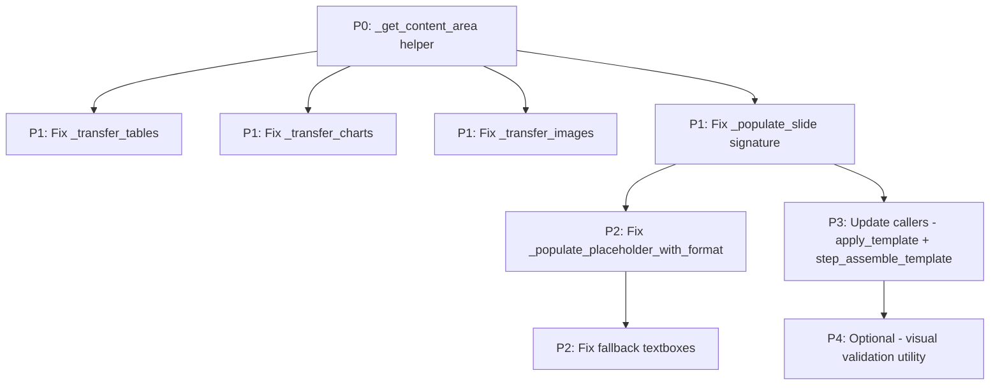
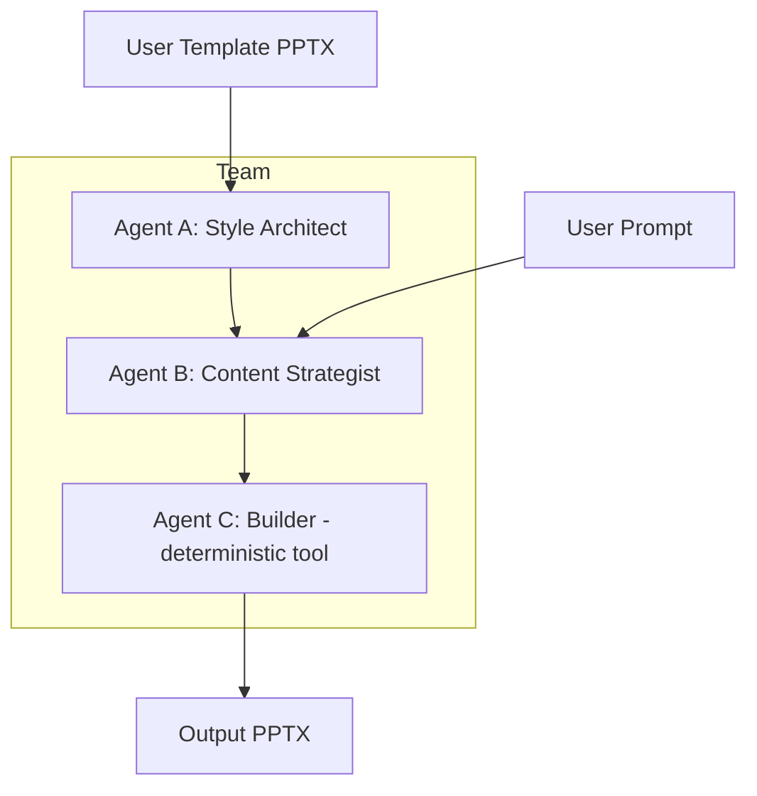

# Design: Visual Quality Improvements for PowerPoint Template Assembly

**Date:** 2026-02-19
**Last Updated:** 2026-03-04
**Status:** Implemented (Phase 1 + Phase 2 + Phase 3)
**Files affected:**
- `cookbook/90_models/anthropic/skills/powerpoint_workflow_demo/powerpoint_template_workflow.py`
- `cookbook/90_models/anthropic/skills/powerpoint_workflow_demo/powerpoint_chunked_workflow.py` (inherits all improvements via `from powerpoint_template_workflow import *`; also adds a 3-tier chunk generation fallback — see below)

---

## Implementation Status

## Scope: Both Workflows

The visual quality improvements described in this document apply to **both** workflow files:

| File | How improvements apply |
|------|----------------------|
| `powerpoint_template_workflow.py` | Direct implementation — all functions live here |
| `powerpoint_chunked_workflow.py` | Via wildcard import — inherits all functions automatically. `step_process_chunks()` calls `step_generate_images()` and `step_assemble_template()` per chunk; `step_visual_review_chunks()` calls `step_visual_quality_review()` per chunk. |

**Important:** Visual quality improvements (both Phase 1 deterministic fixes and Phase 2 visual review) only apply in the chunked workflow **when `--template` is provided**. In raw generation mode (no template), `step_process_chunks` and `step_visual_review_chunks` are skipped entirely — the chunked workflow merges raw Claude-generated PPTX files directly.

> **3-Tier Chunk Generation Fallback (chunked workflow only):**
> `powerpoint_chunked_workflow.py` adds a production reliability layer on top of the template assembly pipeline. When the Claude PPTX skill (Tier 1) times out (>300s) or fails, the system automatically escalates to Tier 2 (LLM + `python-pptx` code generation via `PythonTools`) and then Tier 3 (text-only `python-pptx` fallback). The Tier 2 and Tier 3 outputs feed into the same `step_process_chunks()` template assembly and `_merge_pptx_zip_level()` pipeline unchanged. See `README.md` for the full fallback table.

---

### Phase 1: Deterministic Quality Improvements — COMPLETE ✅

All five Phase 1 improvements have been implemented in `powerpoint_template_workflow.py` (2026-02-25):

| Fix | Function(s) | Status |
|-----|------------|--------|
| Shape coordinate rescaling | `_rescale_shape_xml()`, `_transfer_shapes()` | ✅ Implemented |
| Footer standardization | `_populate_footer_placeholders()`, `--footer-text`, `--date-text`, `--show-slide-numbers` | ✅ Implemented |
| Line-length wrap factor | `_compute_text_ratio()` | ✅ Implemented |
| Source slide dimensions stored | `step_generate_content()` → `session_state["src_slide_width/height"]` | ✅ Implemented |
| `fit_text()` fallback hardening | `_populate_placeholder_with_format()` | ✅ Implemented |

**Template Style Extraction (earlier implementation):** The core template style extraction and application system was implemented as a deterministic extraction pipeline. The system directly parses the template's theme XML (`clrScheme`, `fontScheme`) and scans reference visual elements (tables, charts) to extract their styling. Applied via `_apply_table_style()` and `_apply_chart_style()` during template assembly:
- **Deterministic extraction** instead of AI-based style analysis
- **Reference element priority** — template's existing table/chart styling takes precedence
- **Cascading fallback** — reference styling → theme colors/fonts → hardcoded defaults

**Layout collision resolution (earlier implementation):** The `RegionMap` + `_compute_region_map()` system separates text and visual content into non-overlapping regions. `_ensure_text_on_top()` handles z-order. `_find_best_layout()` uses a scoring system to select the most appropriate template layout per slide.

### Phase 2: Visual Review Agent — COMPLETE ✅

The optional Step 5 visual quality review agent has been implemented (2026-02-25):

| Component | Function(s) | Status |
|-----------|------------|--------|
| Pydantic schemas | `ShapeIssue`, `SlideQualityReport`, `PresentationQualityReport` | ✅ Implemented |
| Rendering | `_render_pptx_to_images()` (LibreOffice headless) | ✅ Implemented |
| Vision agent | `slide_quality_reviewer` (Gemini 2.5 Flash + `output_schema=SlideQualityReport`) | ✅ Implemented |
| Correction dispatcher | `_apply_visual_corrections()` | ✅ Implemented |
| Step 5 executor | `step_visual_quality_review()` | ✅ Implemented |
| CLI flag | `--visual-review` | ✅ Implemented |

See [`ARCHITECTURE_powerpoint_template_workflow.md`](ARCHITECTURE_powerpoint_template_workflow.md) for full details on all implementations, including the chunked workflow architecture, pipeline modes, and session state schema.

### Phase 3: Template Quality Safeguards — COMPLETE ✅

Five interconnected fixes targeting template-specific styling failures (2026-03-04). These bugs only manifest when `--template` is provided because the template introduces dark backgrounds, restricted content areas, and inherited styling that the original code did not account for.

| Fix | Function(s) | Problem Solved | Status |
|-----|------------|----------------|--------|
| Per-slide PNG rendering | `_render_pptx_to_images()` | Visual review only saw slide 1 | ✅ Implemented |
| Background color detection | `_get_shape_background_color()` | Dark backgrounds defaulted to white | ✅ Implemented |
| Minimum font size guard | `_populate_placeholder_with_format()`, `_populate_slide()` | Text shrunk to 4pt | ✅ Implemented |
| Shape overlap reflow | `_fix_overlapping_shapes()` | Content shapes overlap after resize | ✅ Implemented |
| Template-aware LLM prompts | `generate_chunk_pptx_v2()` | LLM unaware of template constraints | ✅ Implemented |

---

#### Fix 1: Per-Slide PNG Rendering — Technical Deep-Dive

**Root cause:** LibreOffice's `--convert-to png` converts an entire PPTX file into a single PNG image (first slide only). The visual review loop iterated over the returned image list (always length 1) and reported "No corrections needed" because the only slide it inspected (slide 1, typically a title slide) had no defects. Slides 2-N — where all the contrast, overlap, and font issues lived — were never inspected.

**Evidence from logs:** `Rendered 1 slide(s)` for a 3-slide chunk, followed by `Reviewing slide 1 / 1`.

**Solution approach — PPTX→PDF→PNG pipeline:**

```
PPTX ──LibreOffice──► PDF ──pdftoppm──► slide-001.png, slide-002.png, ...
         (headless)         (poppler)
```

1. **PPTX→PDF:** `libreoffice --headless --convert-to pdf <file>.pptx` produces a multi-page PDF where each page = one slide. This is reliable across LibreOffice versions.
2. **PDF→PNG:** `pdftoppm -png -r 150 <file>.pdf <prefix>` renders each PDF page as a separate PNG file at 150 DPI. This produces files named `<prefix>-01.png`, `<prefix>-02.png`, etc.
3. **Fallback:** If `pdftoppm` is not found (`shutil.which("pdftoppm") is None`), falls back to the old `--convert-to png` single-image approach with a `[RENDER WARNING]` log.

**System dependency:** `poppler-utils` (`sudo apt-get install -y poppler-utils`) provides `pdftoppm`.

**Logging:** `[RENDER] Successfully rendered N per-slide PNG(s) via PDF pipeline.`

**Test result:** 10-slide template correctly rendered 10 PNG files.

---

#### Fix 2: Background Color Detection — Technical Deep-Dive

**Root cause:** `_get_shape_background_color()` only checked for `solidFill` XML elements on the slide background. Templates like `Career-Path-Template.pptx` use dark backgrounds defined via:
- Image fills (`blipFill`) — a dark photo/gradient image
- Gradient fills (`gradFill`) — dark-to-light gradient
- Background references (`bgRef`) pointing to theme colors
- Master slide backgrounds inherited by all layouts/slides

When none of these matched the `solidFill` check, the function returned `"FFFFFF"` (white). This caused the contrast checker to allow dark text colors (e.g., `#44546A` dark blue) which are invisible on the actual dark background.

**Solution — 6-layer detection cascade:**

```
Layer 1: Shape's own solidFill → direct color
Layer 2: Slide background solidFill → direct color
Layer 3: Slide background blipFill/gradFill/bgRef → heuristic dark detection
Layer 4: Slide layout background → same checks as layers 2-3
Layer 5: Slide master background → same checks as layers 2-3
Layer 6: Large background-covering shapes → shapes ≥80% of slide area
Fallback: Theme dk1 color if luminance < 0.3, else "FFFFFF"
```

**Key implementation details:**
- **Image fills (`blipFill`):** If the slide background contains an embedded image, we assume dark (most corporate templates use dark hero images).
- **Gradient fills (`gradFill`):** We extract the first gradient stop color and compute its luminance. If luminance < 0.4, the background is dark.
- **Background references (`bgRef`):** These reference theme `fillStyleLst` entries. We check if the reference index points to a dark fill.
- **Theme heuristic:** If the template's `dk1` theme color has luminance < 0.3, it's a strong signal that the template uses a dark color scheme. We use `dk1` as the background color.
- **Luminance formula:** Standard relative luminance: `0.2126*R + 0.7152*G + 0.0722*B` (after sRGB linearization).

**Logging:** `[BG DETECT] Slide N: bg=#333333, lum=0.033, dark=True`

**Test result:** Career-Path-Template slide 1 → `#333333` (dark, correct), slides 2-9 → `#FFFFFF` (light, correct), slide 10 → `#333333` (dark, correct). Previously all returned `#FFFFFF`.

---

#### Fix 3: Minimum Font Size Guard — Technical Deep-Dive

**Root cause:** python-pptx's `fit_text()` calculates the largest font size that fits text within a bounding box, but it has no minimum — it will shrink to 4pt, 3pt, even 1pt to make everything fit. Combined with the template's small content areas (Fix 4), this produced unreadable microscopic text.

The chain: LLM generates 8 bullet points → template's body area is small (~40% of slide) → `fit_text()` shrinks to 4pt to fit all 8 bullets → text is invisible.

**Solution — Post-`fit_text()` enforcement:**

```python
# Module-level constants
_MIN_BODY_FONT_PT = 10   # Minimum body text
_MIN_TITLE_FONT_PT = 14  # Minimum title text

# After fit_text() runs:
for paragraph in text_frame.paragraphs:
    for run in paragraph.runs:
        if run.font.size and run.font.size < Pt(min_pt):
            run.font.size = Pt(min_pt)  # Enforce floor
```

**Applied in two locations:**
1. `_populate_placeholder_with_format()` — after the primary `fit_text()` call
2. `_populate_slide()` — after the fallback textbox `fit_text()` call

**Trade-off:** At the minimum font size, text may overflow its bounding box. The visual review (if enabled) can catch and report this. We chose legibility over containment — 10pt text that overflows is better than 4pt text that fits but can't be read.

**Logging:** `[FONT GUARD] Font size was below 10pt minimum — enforced 10pt.`

**Known limitation:** Text truncation with "…" (planned) was not implemented — overflow at minimum size is handled by the visual review step instead.

---

#### Fix 4: Shape Overlap Detection & Reflow — Technical Deep-Dive

**Root cause:** When `_transfer_shapes()` copies LLM-generated shapes from the generated PPTX into the template, it rescales based on `src_width/height → target_area`. But the LLM generates shapes positioned for a **full 10×7.5 inch slide**, while the template's usable content area may be much smaller (e.g., only 40% of the right side, because the left side is a decorative element). Rescaling preserves relative positions, but shapes that were spaced apart on the full slide end up overlapping in the compressed area.

**Solution — 3-phase post-transfer overlap resolution:**

```
Phase 1: Enforce minimum shape dimensions
    - Min width = 8% of slide width
    - Min height = 4% of slide height
    - Prevents microscopic shapes that survived rescaling

Phase 2: Detect & reflow overlaps
    - Sort all non-placeholder shapes by vertical position (top coordinate)
    - For each pair of vertically adjacent shapes:
      - Check if they overlap (considering both X and Y coordinates)
      - If overlap found: push the lower shape down below the upper shape + 2% gap
    - This effectively "stacks" overlapping shapes vertically

Phase 3: Scale-down if off-slide
    - After reflow, some shapes may be pushed beyond slide bottom
    - If so, compute a uniform scale factor to bring all shapes back on-slide
    - Maximum reduction: 50% (prevents shapes from becoming too small)
    - Apply uniform scaling to all shapes for visual consistency
```

**Called in `_populate_slide()`** immediately after `_transfer_shapes()` completes.

**Logging:** `[OVERLAP FIX] Resolved N overlapping shape(s) via vertical reflow.`

**Known limitation:** Max shape count enforcement (planned: skip shapes if >5 in small area) was not implemented — reflow handles most cases, but extremely dense slides may still look crowded.

---

#### Fix 5: Template Context in Tier 2 LLM Prompt — Technical Deep-Dive

**Root cause:** The Tier 2 code generation prompt tells the LLM to write `python-pptx` code that creates a full PPTX from scratch. The LLM has no awareness of:
- The template's dark/light background
- The template's restricted content area
- The template's existing decorative elements
- The template's theme colors

This means the LLM generates dark text (standard `#000000`) for a template with a `#333333` dark background, creating invisible text. The template assembly step later transplants this content, but the damage is done at the code generation level.

**Solution — conditional prompt injection in `generate_chunk_pptx_v2()`:**

```python
# Only when template_path is set:
if session_state.get("template_path"):
    bg_is_dark = _get_shape_background_color(...) → luminance < 0.5
    
    template_context = f"""
TEMPLATE CONSTRAINTS (CRITICAL):
- The template has a {'DARK' if bg_is_dark else 'LIGHT'} background ({bg_hex}).
- You MUST use {'WHITE' if bg_is_dark else 'DARK'} text for ALL text elements.
- Keep each slide SIMPLE: maximum 4-5 content shapes per slide.
- Do NOT add background shapes or gradient fills — the template provides these.
- Use large, readable font sizes (titles ≥ 24pt, body ≥ 14pt).
"""
    code_gen_prompt = template_context + code_gen_prompt
```

**Key design decisions:**
- **Conditional activation:** Only injects constraints when `template_path` is present — non-template runs are completely unaffected.
- **Background detection reuse:** Uses the same `_get_shape_background_color()` function from Fix 2 to determine dark/light.
- **Prevention over cure:** Fix 5 prevents the problem at source (LLM generates compatible code), while Fixes 2-4 handle the symptoms during assembly.

**Logging:** `[TEMPLATE CTX] Injected template constraints into Tier 2 prompt: bg=#333333 (dark), text=WHITE`

---

#### New Constants & Logging Tags

**Module-level constants:**

| Constant | Value | Purpose |
|----------|-------|---------|
| `_MIN_BODY_FONT_PT` | 10 | Floor for body text — `fit_text()` cannot shrink below this |
| `_MIN_TITLE_FONT_PT` | 14 | Floor for title text — `fit_text()` cannot shrink below this |

**New logging tags (always printed, no `--verbose` needed):**

| Tag | When Emitted | Example Output |
|-----|-------------|---------------|
| `[RENDER]` | After slide→PNG rendering | `[RENDER] Successfully rendered 10 per-slide PNG(s) via PDF pipeline.` |
| `[RENDER WARNING]` | `pdftoppm` not available | `[RENDER WARNING] pdftoppm not found. Falling back to single-image mode.` |
| `[BG DETECT]` | During background analysis | `[BG DETECT] Slide 1: bg=#333333, lum=0.033, dark=True` |
| `[FONT GUARD]` | When min font enforced | `[FONT GUARD] Font size was below 10pt minimum — enforced 10pt.` |
| `[OVERLAP FIX]` | After overlap resolution | `[OVERLAP FIX] Resolved 2 overlapping shape(s) via vertical reflow.` |
| `[TEMPLATE CTX]` | Prompt injection | `[TEMPLATE CTX] Injected template constraints: bg=#333333 (dark)` |

---

## Problem Analysis

When Claude generates a PowerPoint presentation via its `pptx` skill, the generated slide elements have EMU positions and font sizes that are specific to the default slide dimensions Claude uses. The template assembly step transfers these raw values unchanged, causing visual defects:

### Issue 1: Text Not Fitting in Placeholders

**Root cause:** `_populate_placeholder_with_format()` copies text into template placeholders but never sets `word_wrap`, `auto_size`, or calls `fit_text()`. The template placeholder's reference formatting may include a font size that is too large for the amount of text being inserted.

**Current code path** (`_populate_placeholder_with_format()` at lines 305-353 in workflow, 298-368 in standalone):
- Captures reference paragraph/run XML formatting from the template placeholder
- Clears the text frame
- Inserts new paragraphs with cloned formatting
- **Does not** set `tf.word_wrap = True`
- **Does not** set `tf.auto_size`
- **Does not** call `tf.fit_text()`

**Fallback path** (`_populate_slide()` when placeholders are not matched):
- Creates textboxes with hardcoded positions: `Inches(0.5), Inches(0.3)` for title, `Inches(0.5), Inches(1.8)` for body
- These positions assume a 10-inch-wide slide and may not match the template's actual content region

### Issue 2: Tables Overflowing

**Root cause:** `_transfer_tables()` uses `td.left`, `td.top`, `td.width`, `td.height` directly from the source slide. Claude's generated tables often extend to the full width of its default slide, which may not match the template's safe content area. Additionally, no font size is set on table cells, so they inherit the default (usually 18pt), which is too large for dense data tables.

**Current code** (`_transfer_tables()` at lines 356-370 in workflow, 370-387 in standalone):
```python
table_shape = slide.shapes.add_table(
    num_rows, num_cols, td.left, td.top, td.width, td.height
)
# Cell text is set but font size is never controlled
table.cell(r_idx, c_idx).text = cell_text
```

### Issue 3: Charts Too Small

**Root cause:** `_transfer_charts()` preserves the original EMU positions from Claude's slide. If Claude placed a chart in a smaller region or the template's content area is larger, the chart will appear undersized.

**Current code** (`_transfer_charts()` at lines 382-410 in workflow, 399-430 in standalone):
```python
slide.shapes.add_chart(
    cd.chart_type, cd.left, cd.top, cd.width, cd.height, chart_data
)
```

### Issue 4: Images Mispositioned

**Root cause:** `_transfer_images()` and the hardcoded AI-generated image positions in `step_assemble_template()` use absolute EMU values that do not account for the template's layout.

**Current code** (`_transfer_images()` and workflow step 4):
```python
# transfer_images uses source EMU positions
slide.shapes.add_picture(image_stream, img.left, img.top, img.width, img.height)

# AI-generated images use hardcoded positions
ImageData(blob=image_bytes, left=int(Inches(1.0)), top=int(Inches(2.0)),
          width=int(Inches(4.0)), height=int(Inches(3.0)))
```

### Issue 5: No Content Area Awareness

None of the transfer functions know where the template's "safe content area" is. They operate blindly with source coordinates. The template's layout placeholders define exactly where content should go, but this information is never extracted or used.

---

## Proposed Solution

### New Helper: `_get_content_area()`

Introduce a function that inspects a template slide layout to determine the safe content region. This region is derived from the layout's placeholders excluding the title.

```python
@dataclass
class ContentArea:
    """Defines the safe content region on a template slide."""
    left: int    # EMU
    top: int     # EMU
    width: int   # EMU
    height: int  # EMU

def _get_content_area(layout, slide_width: int, slide_height: int) -> ContentArea:
    """Derive the content area from a template layout's placeholders.

    Strategy:
    1. Look for a body placeholder (idx=1) - its position defines the content area.
    2. If no body placeholder, look for any placeholder with idx > 0.
    3. If no placeholders at all, use a default safe margin:
       - left: 5% of slide width
       - top: 25% of slide height (below typical title)
       - width: 90% of slide width
       - height: 65% of slide height

    Args:
        layout: A python-pptx SlideLayout object.
        slide_width: Presentation slide width in EMU.
        slide_height: Presentation slide height in EMU.

    Returns:
        ContentArea with the computed safe region.
    """
```

This function is the **foundation** for all other fixes because every transfer function needs to know where to place content.

### Fix 1: Text Auto-Fitting in `_populate_placeholder_with_format()`

**Approach:** Use python-pptx's built-in `fit_text()` method combined with `word_wrap = True`. The `fit_text()` method calculates the largest font size that fits all text within the placeholder's bounding box, up to a specified `max_size`.

**Changes to `_populate_placeholder_with_format()`:**

```python
def _populate_placeholder_with_format(shape, texts, is_title=False):
    """Populate a placeholder with text, enabling word wrap and auto-fitting."""
    if not shape.has_text_frame:
        return

    tf = shape.text_frame

    # --- NEW: Enable word wrap before anything else ---
    tf.word_wrap = True

    # ... existing formatting capture and text insertion logic ...

    # --- NEW: After all text is inserted, auto-fit the font size ---
    try:
        max_size = 28 if is_title else 18
        tf.fit_text(font_family="Calibri", max_size=max_size)
    except Exception:
        # fit_text requires font metrics; fall back to MSO_AUTO_SIZE
        from pptx.enum.text import MSO_AUTO_SIZE
        tf.auto_size = MSO_AUTO_SIZE.TEXT_TO_FIT_SHAPE
```

**Why `fit_text()` over `MSO_AUTO_SIZE.TEXT_TO_FIT_SHAPE`:**
- `fit_text()` is deterministic and applies immediately in the saved file
- `MSO_AUTO_SIZE.TEXT_TO_FIT_SHAPE` only takes effect when PowerPoint renders the file; the raw OOXML still contains the original font sizes
- `fit_text()` requires font files to be available on the system (Calibri is standard); the fallback to `MSO_AUTO_SIZE` handles headless servers

**Changes to fallback textboxes in `_populate_slide()`:**

Replace hardcoded positions with `ContentArea`-derived values:

```python
def _populate_slide(new_slide, content: SlideContent, content_area: ContentArea):
    """Transfer content into a slide using the template's content area."""
    # ... existing placeholder logic ...

    # Fallback title textbox: use full slide width with margins
    if not title_placed and content.title:
        txBox = new_slide.shapes.add_textbox(
            content_area.left,
            Inches(0.3),  # title stays near top
            content_area.width,
            Inches(1.0),
        )
        tf = txBox.text_frame
        tf.word_wrap = True
        tf.text = content.title
        for para in tf.paragraphs:
            para.font.size = Pt(28)
            para.font.bold = True

    # Fallback body textbox: use content area bounds
    if not body_placed and content.body_paragraphs:
        txBox = new_slide.shapes.add_textbox(
            content_area.left,
            content_area.top,
            content_area.width,
            content_area.height,
        )
        tf = txBox.text_frame
        tf.word_wrap = True
        # ... insert paragraphs ...
        try:
            tf.fit_text(font_family="Calibri", max_size=18)
        except Exception:
            pass
```

### Fix 2: Table Repositioning and Font Sizing

**Approach:** Reposition tables into the content area and apply controlled font sizing to cells.

**Changes to `_transfer_tables()`:**

```python
def _transfer_tables(slide, tables, content_area: ContentArea):
    """Transfer tables, repositioned to the content area with controlled font sizes."""
    TABLE_CELL_FONT_SIZE = Pt(10)
    TABLE_HEADER_FONT_SIZE = Pt(11)
    TABLE_PADDING = Inches(0.05)  # cell internal margin

    for td in tables:
        num_rows = len(td.rows)
        num_cols = len(td.rows[0]) if td.rows else 0
        if num_rows == 0 or num_cols == 0:
            continue

        # --- NEW: Reposition to content area ---
        table_shape = slide.shapes.add_table(
            num_rows, num_cols,
            content_area.left,
            content_area.top,
            content_area.width,
            content_area.height,
        )
        table = table_shape.table

        for r_idx, row_data in enumerate(td.rows):
            for c_idx, cell_text in enumerate(row_data):
                if c_idx < num_cols:
                    cell = table.cell(r_idx, c_idx)
                    cell.text = cell_text

                    # --- NEW: Control font size ---
                    for para in cell.text_frame.paragraphs:
                        para.font.size = (
                            TABLE_HEADER_FONT_SIZE if r_idx == 0
                            else TABLE_CELL_FONT_SIZE
                        )

                    # --- NEW: Enable word wrap in cells ---
                    cell.text_frame.word_wrap = True
```

**Additional consideration:** If multiple tables exist on one slide, they should be stacked vertically within the content area. A simple approach:

```python
# If multiple tables, split the content area height evenly
per_table_height = content_area.height // len(tables)
table_top = content_area.top + (i * per_table_height)
```

### Fix 3: Chart Repositioning and Sizing

**Approach:** Fill the content area with charts, giving them the maximum available space.

**Changes to `_transfer_charts()`:**

```python
def _transfer_charts(slide, charts, content_area: ContentArea):
    """Transfer charts, repositioned to fill the content area."""
    try:
        from pptx.chart.data import CategoryChartData
    except ImportError:
        return

    for i, cd in enumerate(charts):
        try:
            chart_data = CategoryChartData()
            chart_data.categories = cd.categories
            for series_name, series_values in cd.series:
                clean_values = [
                    v if isinstance(v, (int, float)) else 0
                    for v in (series_values or [])
                ]
                chart_data.add_series(series_name, clean_values)

            # --- NEW: Use content area for positioning ---
            # If multiple charts, stack vertically
            num_charts = len(charts)
            chart_height = content_area.height // num_charts
            chart_top = content_area.top + (i * chart_height)

            slide.shapes.add_chart(
                cd.chart_type,
                content_area.left,
                chart_top,
                content_area.width,
                chart_height,
                chart_data,
            )
        except Exception:
            pass
```

### Fix 4: Image Repositioning

**Approach:** Position images within the content area, maintaining aspect ratio.

**New helper function:**

```python
def _fit_to_area(
    img_width: int,
    img_height: int,
    area: ContentArea,
) -> tuple:
    """Scale dimensions to fit within an area while preserving aspect ratio.

    Returns:
        Tuple of (left, top, width, height) in EMU, centered in the area.
    """
    aspect = img_width / img_height
    area_aspect = area.width / area.height

    if aspect > area_aspect:
        # Image is wider than area: fit to width
        new_width = area.width
        new_height = int(new_width / aspect)
    else:
        # Image is taller than area: fit to height
        new_height = area.height
        new_width = int(new_height * aspect)

    # Center within the area
    left = area.left + (area.width - new_width) // 2
    top = area.top + (area.height - new_height) // 2

    return left, top, new_width, new_height
```

**Changes to `_transfer_images()`:**

```python
def _transfer_images(slide, images, content_area: ContentArea):
    """Transfer images, repositioned and scaled to fit the content area."""
    for img in images:
        image_stream = BytesIO(img.blob)

        # --- NEW: Scale and center in content area ---
        left, top, width, height = _fit_to_area(
            img.width, img.height, content_area
        )
        slide.shapes.add_picture(image_stream, left, top, width, height)
```

**Changes to AI-generated image positions in `step_assemble_template()`:**

Remove the hardcoded `Inches()` values and let the `_transfer_images()` function handle positioning:

```python
# Before: hardcoded position
ImageData(blob=image_bytes, left=int(Inches(1.0)), top=int(Inches(2.0)),
          width=int(Inches(4.0)), height=int(Inches(3.0)))

# After: use placeholder values that _transfer_images will override
# Use 0,0 as sentinel values since _transfer_images now uses content_area
ImageData(blob=image_bytes, left=0, top=0,
          width=int(Inches(8.0)), height=int(Inches(4.5)),
          content_type="image/png")
```

### Fix 5: Shared Content Area in `_populate_slide()`

The orchestrating function `_populate_slide()` must compute the content area once and pass it to all transfer functions.

**New signature:**

```python
def _populate_slide(
    new_slide,
    content: SlideContent,
    slide_width: int,
    slide_height: int,
):
    """Transfer all content into a slide using template-aware positioning."""
    # Compute content area from the slide's layout
    content_area = _get_content_area(
        new_slide.slide_layout, slide_width, slide_height
    )

    # ... text placement logic (with fit_text) ...

    _transfer_tables(new_slide, content.tables, content_area)
    _transfer_images(new_slide, content.images, content_area)
    _transfer_charts(new_slide, content.charts, content_area)
    _transfer_shapes(new_slide, content.shapes_xml)
```

**Callers update** (both `apply_template()` and `step_assemble_template()`):

```python
output_prs = Presentation(output_path)
slide_width = output_prs.slide_width
slide_height = output_prs.slide_height

# ... in the loop:
_populate_slide(new_slide, content, slide_width, slide_height)
```

---

## Multi-Modal Visual Validation

### The Idea

Use a vision model (e.g., Gemini, Claude with vision) to render each slide as an image and check for visual defects: text overflow, clipped elements, empty placeholders, misaligned content.

### Feasibility Analysis

| Factor | Assessment |
|--------|------------|
| **Rendering slides to images** | python-pptx cannot render slides. Requires LibreOffice headless (`libreoffice --headless --convert-to png`) or a commercial API. LibreOffice is available on most CI/Linux systems but adds a heavy dependency. |
| **Vision model accuracy** | Modern vision models can reliably detect obvious issues (text cut off, elements overlapping edges) but may miss subtle sizing problems. |
| **Latency** | Rendering N slides + N vision API calls adds significant latency. A 6-slide deck would add ~30-60 seconds. |
| **Cost** | Each vision call costs tokens. At ~1000 tokens per image analysis, a 6-slide validation is modest but non-trivial. |
| **Actionability** | The model can identify problems but cannot directly fix them. A feedback loop (detect, adjust, re-render, re-check) compounds the latency and cost issues. |

### Recommendation: Not Recommended as Primary Strategy

**Deterministic layout rules (Fixes 1-5 above) should be the primary approach.** They are:
- Zero additional latency
- Zero additional cost
- Predictable and testable
- Effective for the specific issues reported

**However**, multi-modal validation could be valuable as an **optional debug/QA tool**:

```python
def _validate_slides_visual(pptx_path: str, model: str = "gemini-2.5-flash") -> list:
    """Optional: Validate slide visuals using a vision model.

    Returns a list of issues found per slide. Requires LibreOffice for rendering.
    Intended for development/QA, not production pipeline.
    """
```

**If implemented later**, the recommended approach would be:
1. Use LibreOffice headless to export each slide as PNG
2. Send each PNG to a vision model with a structured prompt asking about specific defects
3. Return a structured report (slide index, issue type, severity)
4. Do NOT attempt auto-remediation in the first version

This could live as a separate utility function rather than being wired into the main assembly pipeline.

---

## Implementation Priority

The fixes should be implemented in this order, based on impact and dependency:



| Priority | Change | Impact |
|----------|--------|--------|
| **P0** | Add `ContentArea` dataclass and `_get_content_area()` | Foundation for all other fixes |
| **P1** | Update `_transfer_tables()` with content area + cell font sizing | Fixes table overflow - the most visually jarring issue |
| **P1** | Update `_transfer_charts()` with content area | Fixes undersized charts |
| **P1** | Update `_transfer_images()` + add `_fit_to_area()` | Fixes image positioning |
| **P1** | Update `_populate_slide()` signature to accept slide dimensions | Required for passing content area to transfer functions |
| **P2** | Add `word_wrap` + `fit_text()` to `_populate_placeholder_with_format()` | Fixes text overflow in placeholders |
| **P2** | Update fallback textboxes in `_populate_slide()` | Fixes positioning when placeholder matching fails |
| **P3** | Update callers: `apply_template()` and `step_assemble_template()` | Wires slide dimensions through to `_populate_slide()` |
| **P3** | Remove hardcoded AI-image positions in workflow | Fixes NanoBanana image placement |
| **P4** | Optional: multi-modal validation utility | QA/debug tool, not production-critical |

---

## Key Code Changes Summary

### New Functions

| Function | Purpose | File Location |
|----------|---------|---------------|
| `_get_content_area(layout, slide_width, slide_height) -> ContentArea` | Derive safe content bounds from template layout | Both files |
| `_fit_to_area(img_width, img_height, area) -> tuple` | Scale + center an element within an area | Both files |

### New Data Structures

| Structure | Purpose |
|-----------|---------|
| `ContentArea` dataclass | Holds `left`, `top`, `width`, `height` in EMU for the content region |

### Modified Function Signatures

| Function | Old Signature | New Signature |
|----------|---------------|---------------|
| `_populate_slide` | `(new_slide, content)` | `(new_slide, content, slide_width, slide_height)` |
| `_transfer_tables` | `(slide, tables)` | `(slide, tables, content_area)` |
| `_transfer_charts` | `(slide, charts)` | `(slide, charts, content_area)` |
| `_transfer_images` | `(slide, images)` | `(slide, images, content_area)` |
| `_populate_placeholder_with_format` | `(shape, texts, is_title)` | No signature change; behavior changes internally |

### Modified Callers

| Caller | Change |
|--------|--------|
| `apply_template()` in standalone | Pass `output_prs.slide_width`, `output_prs.slide_height` to `_populate_slide()` |
| `step_assemble_template()` in workflow | Same as above |

### New Imports Required

```python
from pptx.enum.text import MSO_AUTO_SIZE  # for auto_size fallback
```

---

## Code Synchronization Note

`powerpoint_chunked_workflow.py` imports all core functions from `powerpoint_template_workflow.py` via `from powerpoint_template_workflow import *`. This means:

- **No duplication** of helper functions, agents, Pydantic models, or step functions between the two files
- Any fix to a core function in `powerpoint_template_workflow.py` is automatically available in `powerpoint_chunked_workflow.py`
- The chunked workflow only adds chunked-specific logic (storyboard planning, chunk generation, chunk merging) on top

The earlier note about applying changes to "both files" no longer applies — `powerpoint_template_workflow.py` is the single source of truth for all shared functions. Consider extracting to a `_pptx_template_utils.py` module in a future refactor if the wildcard import becomes unwieldy, but that is out of scope for this design.

---

## Testing Strategy

1. **Unit-level:** Create a test template with known placeholder dimensions and verify that `_get_content_area()` returns the expected bounds.
2. **Integration:** Run both cookbook scripts against the existing `my_template.pptx` / `my_template1.pptx` files and visually inspect the output.
3. **Edge cases:**
   - Template with no body placeholder (only title)
   - Slide with both a table and a chart (stacking behavior)
   - Very long bullet text (20+ words per bullet) - `fit_text()` should shrink font
   - Table with many columns (7+) - font size should still be readable at Pt(10)
   - Empty slides (no content extracted) - should not crash

---

## Architecture Evolution: Team-Based Refactor (Phase 2)

After the deterministic visual quality fixes (Phase 1) are complete, the workflow should be refactored into a **3-agent Team architecture** for better modularity, style awareness, and maintainability.

### Current Architecture (Workflow)


**Limitations:**
- Content generation is style-blind: Claude generates slides without knowing the templates font sizes, color palette, or layout constraints
- Template analysis happens too late: layout information is only used during assembly, not during content planning
- Monolithic assembly function: `_populate_slide` handles text, tables, charts, images, and shapes in one function

### Proposed Team Architecture (Phase 2)



#### Agent A: The Style Architect

**Role:** Analyzes the users uploaded reference PPTX and produces a structured Style Guide.

**Implementation:** An Agno `Agent` with a custom `PPTXAnalyzerTool` (not a native Agno tool today - must be built).

**Output schema:**

```python
class LayoutSpec(BaseModel):
   """Specification for a single slide layout."""
   layout_index: int
   layout_name: str
   title_area: Optional[ContentArea]  # reuses ContentArea from Phase 1
   body_area: Optional[ContentArea]
   has_body_placeholder: bool
   placeholder_indices: List[int]

class StyleGuide(BaseModel):
   """Complete style specification extracted from a template."""
   slide_width: int   # EMU
   slide_height: int  # EMU
   theme_colors: Dict[str, str]  # e.g. accent1 -> #FF6600
   title_font: str
   body_font: str
   title_font_size: int  # Pt
   body_font_size: int   # Pt
   layouts: List[LayoutSpec]
   recommended_max_bullets: int  # derived from body area height / line height
   recommended_table_font_size: int  # Pt
```

**Why this helps:** The Style Guide captures constraints that are currently invisible to the content generation step. Knowing that the body placeholder is 4.5 inches tall with Pt(14) font means Agent B can plan content that fits.

**Note:** Agno does not have a native `PPTXReader` tool. The `PPTXAnalyzerTool` would be a custom tool wrapping `python-pptx` that reads the template and returns a `StyleGuide`. The `_get_content_area()` helper from Phase 1 becomes part of this tool.

#### Agent B: The Content Strategist

**Role:** Takes the user prompt + Style Guide and generates a slide-by-slide content plan.

**Implementation:** An Agno `Agent` with `output_schema=PresentationPlan`.

**Output schema:**

```python
class SlidePlan(BaseModel):
   """Plan for a single slide."""
   layout_index: int       # which template layout to use
   title: str
   subtitle: Optional[str]
   bullets: Optional[List[str]]
   table_data: Optional[List[List[str]]]
   chart_spec: Optional[Dict]  # type, categories, series
   needs_image: bool
   image_prompt: Optional[str]

class PresentationPlan(BaseModel):
   """Complete plan for all slides."""
   slides: List[SlidePlan]
```

**Key advantage:** Content is planned with layout awareness. If the Style Guide says max 5 bullets at Pt(14), Agent B generates exactly 5 concise bullets instead of 8 long ones that need to be shrunk later.

#### Agent C: The Builder

**Critical design decision:** Agent C should NOT be an LLM that generates python-pptx code. It should be a **deterministic tool** that the Team coordinator invokes.

**Why deterministic over LLM-generated code:**
- LLMs generating python-pptx code introduce non-determinism: they may forget `word_wrap`, use wrong EMU values, skip font sizing
- The visual quality fixes from Phase 1 (content area positioning, `fit_text()`, table font control) are deterministic rules that should always be applied
- A deterministic builder is testable and predictable

**Implementation:** A custom Agno `Toolkit` called `PPTXBuilderTools` with methods:

```python
class PPTXBuilderTools(Toolkit):
   """Deterministic PPTX builder that uses StyleGuide + PresentationPlan."""

   def build_presentation(
       self,
       style_guide: StyleGuide,
       plan: PresentationPlan,
       template_path: str,
       output_path: str,
   ) -> str:
       """Build the final PPTX using all Phase 1 deterministic fixes."""
       # Uses _get_content_area(), fit_text(), table font sizing, etc.
       ...
```

### Team Wiring (using Agno Team)

```python
from agno.team import Team, TeamMode

pptx_team = Team(
   name="PowerPoint Team",
   mode=TeamMode.COORDINATE,
   members=[style_architect, content_strategist, builder_agent],
   instructions=[
       "1. First, delegate to Style Architect to analyze the template.",
       "2. Then, delegate to Content Strategist with the Style Guide + user prompt.",
       "3. Finally, delegate to Builder to assemble the presentation.",
   ],
)
```

### Migration Path

| Phase | What | Depends On |
|-------|------|------------|
| **Phase 1** (this design) | Deterministic visual quality fixes | Nothing |
| **Phase 2a** | Extract shared functions into `_pptx_template_utils.py` | Phase 1 |
| **Phase 2b** | Build `PPTXAnalyzerTool` using `_get_content_area()` + style extraction | Phase 2a |
| **Phase 2c** | Build `PPTXBuilderTools` wrapping the deterministic assembly logic | Phase 2a |
| **Phase 2d** | Create `StyleGuide` and `PresentationPlan` schemas | Phase 2a |
| **Phase 2e** | Wire up the 3-agent Team with Agno Team API | Phase 2b, 2c, 2d |

### Key Principle

The Phase 1 deterministic fixes (`_get_content_area`, `fit_text`, content area repositioning, table font control) are **not thrown away** in Phase 2. They become the internals of `PPTXBuilderTools`. The Team architecture wraps them with style-aware content planning, making the visual quality even better because content is generated to fit from the start.
