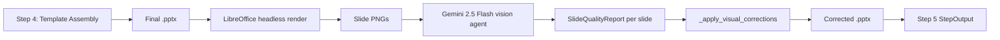
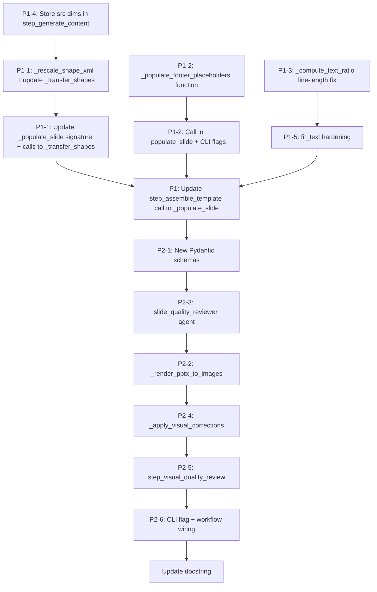

# Plan: PowerPoint Visual Quality Improvements
## Deterministic Fixes + Visual Review Agent

**Target file:** `cookbook/90_models/anthropic/skills/powerpoint_workflow_demo/powerpoint_template_workflow.py`
**Date:** 2026-02-25

---

## Current State Summary

The workflow is a 4-step Agno pipeline (4423 lines):
1. Step 1: Claude pptx skill → raw `.pptx`
2. Step 2: Gemini image planner → `ImagePlan` JSON
3. Step 3: NanoBanana image generation → `{slide_idx: bytes}`
4. Step 4: Template assembly → final `.pptx`

Phase 1 items from `DESIGN_visual_quality.md` have **already been fully implemented** in the current file:
- `ContentArea` dataclass, `_get_content_area()`, `_fit_to_area()` ✅
- `RegionMap`, `_compute_region_map()`, `_find_best_layout()` ✅
- `_apply_table_style()`, `_apply_chart_style()` (template styling) ✅
- `_ensure_text_contrast()`, `_ensure_text_on_top()` ✅
- `_clear_unused_placeholders()`, `_remove_empty_textboxes()` ✅
- `fit_text()` + `word_wrap` in `_populate_placeholder_with_format()` ✅
- Content area positioning for tables, charts, images ✅

**Remaining gaps** are the focus of this plan.

---

## Remaining Issues

### Issue 1 — `_transfer_shapes()` bypasses the region system (Line 2846)

```python
def _transfer_shapes(slide, shapes_xml):
    spTree = slide.shapes._spTree
    for shape_elem in shapes_xml:
        cloned = copy.deepcopy(shape_elem)
        # ... only ID reassignment, no position rescaling ...
        spTree.append(cloned)
```

Raw shape XML is deep-copied at **original absolute EMU positions** from Claude's slide. Claude generates PPTX at default dimensions (12,192,000 × 6,858,000 EMU). The template may have different dimensions, and shapes need repositioning into the template's content area or slide bounds. Result: decorative shapes (dividers, background cards) land at wrong coordinates, potentially overlapping text or falling outside slide bounds.

### Issue 2 — `text_shapes_xml` on TEXT_ONLY slides also bypasses region system (Line 3233)

```python
if content_mix == ContentMix.TEXT_ONLY:
    _transfer_shapes(new_slide, content.text_shapes_xml)
```

Same problem as Issue 1 — non-placeholder text boxes from Claude's slide are copied at original positions.

### Issue 3 — Footer placeholders always stripped (Line 2862)

`_clear_unused_placeholders()` removes ALL placeholders not in `populated_indices`. Footer placeholders (idx=10 date, idx=11 footer text, idx=12 slide number) are **never added** to `populated_indices` in `_populate_slide()`. This means footer content from the template is always stripped, causing inconsistent or absent footers across slides.

### Issue 4 — `_compute_text_ratio()` ignores line length (Line 1784)

Only uses paragraph count to decide text/visual split ratio. Long bullet points (50+ chars) that wrap to multiple display lines are treated the same as short ones, leading to text area underestimation for text-heavy slides.

### Issue 5 — Silent `fit_text()` failure (Line 2631)

When Calibri font files are not installed (headless server, Docker containers without Windows fonts), `fit_text()` raises an exception and falls back to `MSO_AUTO_SIZE.TEXT_TO_FIT_SHAPE`. This setting only applies when PowerPoint **renders** the file — the saved OOXML still contains the original (potentially oversized) font size attribute. Users who view the file with a viewer that doesn't apply auto-size will see overflowed text.

---

## Phase 1: Deterministic Improvements (No New Dependencies)

### P1-1: Rescale shapes in `_transfer_shapes()` to target content area

**New helper function to add** (insert after `_transfer_shapes()` at ~line 2860):

```python
def _rescale_shape_xml(
    shape_elem,
    src_width: int,
    src_height: int,
    target_area: "ContentArea",
) -> None:
    """Rescale a shape element's position/size from source slide dimensions
    to target content area bounds (modifies in-place).

    Finds xfrm/off (origin x,y) and xfrm/ext (size cx,cy) XML elements
    and rescales proportionally from source slide space to target area.

    Handles both <p:sp> (plain shapes) and <p:grpSp> (group shapes).
    """
    ns_a = "http://schemas.openxmlformats.org/drawingml/2006/main"
    ns_p = "http://schemas.openxmlformats.org/presentationml/2006/main"

    def _scale_xfrm(xfrm_elem):
        off = xfrm_elem.find("{%s}off" % ns_a)
        ext = xfrm_elem.find("{%s}ext" % ns_a)
        if off is not None:
            orig_x = int(off.get("x", 0))
            orig_y = int(off.get("y", 0))
            new_x = target_area.left + int((orig_x / src_width) * target_area.width)
            new_y = target_area.top + int((orig_y / src_height) * target_area.height)
            off.set("x", str(new_x))
            off.set("y", str(new_y))
        if ext is not None:
            orig_cx = int(ext.get("cx", 0))
            orig_cy = int(ext.get("cy", 0))
            new_cx = int((orig_cx / src_width) * target_area.width)
            new_cy = int((orig_cy / src_height) * target_area.height)
            ext.set("cx", str(max(1, new_cx)))
            ext.set("cy", str(max(1, new_cy)))

    # Find all xfrm elements within this shape (handles groups recursively)
    for xfrm in shape_elem.iter("{%s}xfrm" % ns_a):
        try:
            _scale_xfrm(xfrm)
        except Exception:
            pass
```

**Modify `_transfer_shapes()` signature** (line 2846):

```python
def _transfer_shapes(
    slide,
    shapes_xml,
    src_width: int = 0,
    src_height: int = 0,
    target_area: "ContentArea | None" = None,
):
    """Transfer simple shapes by deep-copying their XML to the target slide.

    When src_width, src_height, and target_area are provided, rescales
    shape positions proportionally from source slide dimensions into
    target_area bounds to prevent off-screen or overlapping placement.
    """
    spTree = slide.shapes._spTree
    for shape_elem in shapes_xml:
        cloned = copy.deepcopy(shape_elem)
        # ID reassignment (existing logic)
        existing_ids = [
            int(sp.get("id", 0)) for sp in spTree.iter() if sp.get("id") is not None
        ]
        max_id = max(existing_ids) if existing_ids else 0
        for nv_elem in cloned.iter():
            if nv_elem.tag.endswith("}cNvPr"):
                max_id += 1
                nv_elem.set("id", str(max_id))
        # NEW: Rescale to target area if dimensions provided
        if src_width > 0 and src_height > 0 and target_area is not None:
            _rescale_shape_xml(cloned, src_width, src_height, target_area)
        spTree.append(cloned)
```

**Modify `_populate_slide()` calls to `_transfer_shapes()`** (lines 3232-3234):

```python
# Source slide dimensions come from session_state (set in Step 1)
src_w = slide_width   # template slide width as fallback (if source unknown)
src_h = slide_height  # template slide height as fallback

_transfer_shapes(new_slide, content.shapes_xml, src_w, src_h, region_map.visual_region)
if content_mix == ContentMix.TEXT_ONLY:
    _transfer_shapes(new_slide, content.text_shapes_xml, src_w, src_h, region_map.text_region)
```

**Propagate source dimensions**: `_populate_slide()` needs `src_slide_width` and `src_slide_height` parameters. These are stored in `session_state` during Step 1 (see P1-4 below).

**Updated `_populate_slide()` signature**:

```python
def _populate_slide(
    new_slide,
    content: SlideContent,
    slide_width: int,
    slide_height: int,
    generated_image_bytes: bytes | None = None,
    template_style: "TemplateStyle | None" = None,
    src_slide_width: int = 0,     # NEW: source slide width for shape rescaling
    src_slide_height: int = 0,    # NEW: source slide height for shape rescaling
):
```

---

### P1-2: Footer standardization

**Problem**: Footer placeholders (idx=10/11/12) are always removed because they're never in `populated_indices`.

**Add a new function** (insert after `_remove_empty_textboxes()` at ~line 2928):

```python
def _populate_footer_placeholders(
    slide,
    populated_indices: set,
    footer_text: str = "",
    show_slide_number: bool = False,
    date_text: str = "",
) -> None:
    """Populate footer placeholders to prevent them from being stripped.

    PPTX footer placeholder indices:
        10 = date/time
        11 = footer text
        12 = slide number

    If a footer placeholder is found and the corresponding value is provided,
    it is populated and added to populated_indices so _clear_unused_placeholders
    does not remove it.

    If no footer values are provided, nothing is added and the placeholders
    will be removed as normal by _clear_unused_placeholders.
    """
    for shape in list(slide.placeholders):
        ph_idx = shape.placeholder_format.idx
        try:
            if ph_idx == 10 and date_text and shape.has_text_frame:
                shape.text_frame.text = date_text
                populated_indices.add(ph_idx)
            elif ph_idx == 11 and footer_text and shape.has_text_frame:
                shape.text_frame.text = footer_text
                populated_indices.add(ph_idx)
            elif ph_idx == 12 and show_slide_number:
                # Slide number is auto-populated by PowerPoint renderer
                # We keep the placeholder XML but don't set text
                populated_indices.add(ph_idx)
        except Exception:
            continue
```

**Call from `_populate_slide()`** (add near the end, after body is placed but before `_clear_unused_placeholders()`):

```python
# Footer standardization (NEW)
_populate_footer_placeholders(
    new_slide,
    populated_indices,
    footer_text=footer_text or "",
    show_slide_number=show_slide_number,
    date_text=date_text or "",
)
```

**Updated `_populate_slide()` signature addition**:

```python
def _populate_slide(
    ...
    footer_text: str = "",            # NEW: footer text (idx=11)
    date_text: str = "",              # NEW: date text (idx=10)
    show_slide_number: bool = False,  # NEW: keep slide number placeholder
):
```

**New CLI flags** (in `parse_args()`):

```python
parser.add_argument("--footer-text", default="", help="Footer text for all slides.")
parser.add_argument("--show-slide-numbers", action="store_true",
    help="Preserve slide number placeholders in the template footer.")
parser.add_argument("--date-text", default="",
    help="Date text for footer date placeholder.")
```

**Pass footer config through `session_state`**:

```python
session_state = {
    ...
    "footer_text": args.footer_text,
    "date_text": args.date_text,
    "show_slide_numbers": args.show_slide_numbers,
}
```

**Pass footer config into `_populate_slide()` in `step_assemble_template()`**:

```python
_populate_slide(
    new_slide, content, slide_width, slide_height,
    generated_image_bytes=gen_img,
    template_style=template_style,
    src_slide_width=session_state.get("src_slide_width", 0),
    src_slide_height=session_state.get("src_slide_height", 0),
    footer_text=session_state.get("footer_text", ""),
    date_text=session_state.get("date_text", ""),
    show_slide_number=session_state.get("show_slide_numbers", False),
)
```

---

### P1-3: Improve `_compute_text_ratio()` with line-length awareness

**Modify the existing function** (line 1784):

```python
def _compute_text_ratio(content: SlideContent, content_mix: ContentMix) -> float:
    """Compute how much of the content area should be allocated to text.

    Returns a ratio (0.0-1.0) representing the text portion.

    Now factors in average line length to account for line wrapping:
    a slide with 3 very long bullets needs more height than one with
    3 short bullets.
    """
    num_paragraphs = len(content.body_paragraphs)

    # Estimate wrap factor: avg chars / 45 chars-per-line threshold
    CHARS_PER_LINE = 45
    wrap_factor = 1.0
    if content.body_paragraphs:
        total_chars = sum(
            len(text) for text, _level in content.body_paragraphs
        )
        avg_chars = total_chars / len(content.body_paragraphs)
        wrap_factor = max(1.0, avg_chars / CHARS_PER_LINE)

    # Effective line count accounts for text wrapping
    effective_lines = num_paragraphs * wrap_factor

    if content_mix in (
        ContentMix.TEXT_AND_TABLE,
        ContentMix.TEXT_AND_CHART,
        ContentMix.MIXED,
    ):
        # Top/bottom split: 25-50% for text based on effective line count
        if effective_lines <= 2:
            return 0.25
        elif effective_lines <= 4:
            return 0.35
        elif effective_lines <= 6:
            return 0.45
        else:
            return 0.50

    if content_mix in (ContentMix.TEXT_AND_IMAGE, ContentMix.TEXT_AND_GENERATED_IMAGE):
        # Left/right split: 40-60% for text based on effective line count
        if effective_lines <= 2:
            return 0.40
        elif effective_lines <= 4:
            return 0.48
        elif effective_lines <= 6:
            return 0.55
        else:
            return 0.60

    return 0.50  # Default even split
```

---

### P1-4: Store source slide dimensions in `session_state` (Step 1)

**Modify `step_generate_content()`** (line 3700, after `generated_prs = Presentation(generated_file)`):

```python
generated_prs = Presentation(generated_file)
generated_slides = list(generated_prs.slides)

# NEW: Store source slide dimensions for shape rescaling in Step 4
session_state["src_slide_width"] = int(generated_prs.slide_width)
session_state["src_slide_height"] = int(generated_prs.slide_height)
if VERBOSE:
    print(
        "[VERBOSE] Source slide dimensions: %d x %d EMU"
        % (generated_prs.slide_width, generated_prs.slide_height)
    )
```

**Also add to `session_state` schema comment in `__main__`**:

```python
#   src_slide_width    (int)  - Claude-generated slide width in EMU (set by step 1)
#   src_slide_height   (int)  - Claude-generated slide height in EMU (set by step 1)
```

**Initialize in `session_state` dict** (in `__main__`):

```python
"src_slide_width": 0,
"src_slide_height": 0,
```

---

### P1-5: Harden `fit_text()` silent failure

**Modify `_populate_placeholder_with_format()`** (line 2616):

After the existing `fit_text()` try/except block, add an explicit font size safety check to catch silent `MSO_AUTO_SIZE` fallback cases:

```python
# After the fit_text block and re-apply ref_run_xml block...

# P1-5: Safety check — if fit_text() fell back to MSO_AUTO_SIZE,
# estimate whether the current font size would overflow the placeholder
# and apply a conservative manual reduction if needed.
# This guards against headless environments where fit_text() fails silently.
if tf.auto_size == MSO_AUTO_SIZE.TEXT_TO_FIT_SHAPE:
    # auto_size was set, meaning fit_text() failed. Apply manual font reduction
    # based on region height estimate.
    safe_max = _compute_max_font_size(
        ContentArea(
            left=shape.left, top=shape.top,
            width=shape.width, height=shape.height,
        ),
        line_count,
        is_title=is_title,
    )
    ns_a = "{http://schemas.openxmlformats.org/drawingml/2006/main}"
    for para in tf.paragraphs:
        for run in para.runs:
            rPr = run._r.find(ns_a + "rPr")
            if rPr is not None:
                sz = rPr.get("sz")
                if sz and int(sz) > safe_max * 100:
                    rPr.set("sz", str(safe_max * 100))
```

---

### Summary of Phase 1 Code Changes

| Change | Type | Lines affected |
|--------|------|----------------|
| New `_rescale_shape_xml()` helper | New function | Insert after line 2859 |
| Update `_transfer_shapes()` signature + rescaling | Modify | Line 2846–2859 |
| Update both `_transfer_shapes()` calls in `_populate_slide()` | Modify | Lines 3232–3234 |
| Update `_populate_slide()` signature (add `src_*` + footer params) | Modify | Line 2931 |
| New `_populate_footer_placeholders()` function | New function | Insert after line 2928 |
| Call `_populate_footer_placeholders()` in `_populate_slide()` | Modify | ~Line 3334 |
| Update `_compute_text_ratio()` with wrap factor | Modify | Line 1784 |
| Store `src_slide_width/height` in `step_generate_content()` | Modify | ~Line 3700 |
| Update `step_assemble_template()` call to `_populate_slide()` | Modify | Line 4228 |
| Harden `fit_text()` fallback in `_populate_placeholder_with_format()` | Modify | ~Line 2636 |
| New CLI flags: `--footer-text`, `--date-text`, `--show-slide-numbers` | Modify | `parse_args()` line 4251 |
| New `session_state` keys: `footer_text`, `date_text`, etc. | Modify | `__main__` ~line 4402 |

---

## Phase 2: Visual Review Agent (Step 5)

### Architecture Diagram



### P2-1: New Pydantic Schemas

Add after `ImagePlan` class (~line 115):

```python
# ---------------------------------------------------------------------------
# Pydantic Models for Visual Quality Review (Step 5)
# ---------------------------------------------------------------------------

class ShapeIssue(BaseModel):
    """A single visual defect detected on a slide."""

    issue_type: str = Field(
        description="One of: text_overflow, text_too_small, overlap, ghost_text, "
        "low_contrast, element_clipped, empty_placeholder, footer_inconsistent"
    )
    severity: str = Field(description="One of: critical, moderate, minor")
    description: str = Field(description="Human-readable description of the issue")
    programmatic_fix: str = Field(
        description="One of: reduce_font_size, increase_contrast, remove_element, "
        "clear_placeholder, reposition_element, none"
    )
    shape_description: str = Field(
        default="",
        description="Brief description of which shape is affected (e.g., 'title text box')",
    )


class SlideQualityReport(BaseModel):
    """Quality assessment for a single slide."""

    slide_index: int = Field(description="Zero-based slide index")
    overall_quality: str = Field(
        description="One of: good, acceptable, poor"
    )
    is_visually_bland: bool = Field(
        description="True if slide has no visual elements and excessive whitespace"
    )
    blandness_reason: str = Field(
        default="",
        description="If is_visually_bland is True, brief explanation",
    )
    issues: List[ShapeIssue] = Field(
        default_factory=list,
        description="List of detected visual issues",
    )


class PresentationQualityReport(BaseModel):
    """Quality assessment for the entire presentation."""

    slide_reports: List[SlideQualityReport] = Field(
        description="Per-slide quality reports"
    )
    overall_pass: bool = Field(
        description="True if no slides are rated 'poor'"
    )
    total_critical_issues: int = Field(
        description="Total number of critical issues across all slides"
    )
    recommendations: List[str] = Field(
        default_factory=list,
        description="Non-programmatic suggestions (e.g., 'add images to bland slides')",
    )
```

### P2-2: LibreOffice rendering helper

Add near the end of the helpers section, before Step functions (~line 3342):

```python
def _render_pptx_to_images(pptx_path: str, output_dir: str) -> list:
    """Render all slides to PNG images using LibreOffice headless.

    Returns a sorted list of PNG file paths (one per slide, in slide order).
    Raises RuntimeError if LibreOffice is not available or rendering fails.

    Args:
        pptx_path: Path to the .pptx file to render.
        output_dir: Directory to write PNG files into.

    Returns:
        Sorted list of PNG file paths.
    """
    import glob
    import shutil as _shutil
    import subprocess

    lo_cmd = _shutil.which("libreoffice") or _shutil.which("soffice")
    if not lo_cmd:
        raise RuntimeError(
            "LibreOffice not found. Install with: apt-get install libreoffice"
        )

    result = subprocess.run(
        [lo_cmd, "--headless", "--convert-to", "png", "--outdir", output_dir, pptx_path],
        capture_output=True,
        text=True,
        timeout=120,
    )
    if result.returncode != 0:
        raise RuntimeError(
            "LibreOffice rendering failed (exit %d): %s"
            % (result.returncode, result.stderr[:300])
        )

    # LibreOffice output naming varies by version: "name-slide-N.png" or "nameN.png"
    base = os.path.splitext(os.path.basename(pptx_path))[0]
    for pattern in [
        os.path.join(output_dir, "%s-slide-*.png" % base),
        os.path.join(output_dir, "%s*.png" % base),
    ]:
        pngs = sorted(glob.glob(pattern))
        if pngs:
            return pngs

    return []
```

### P2-3: Vision model agent

Add immediately after the `image_planner` agent definition (~line 3812):

```python
# ---------------------------------------------------------------------------
# Step 5 Agent: Slide Quality Reviewer
# ---------------------------------------------------------------------------

# This agent is only instantiated if --visual-review is enabled.
# It uses Gemini 2.5 Flash vision capability to inspect rendered slide images.
slide_quality_reviewer = Agent(
    name="Slide Quality Reviewer",
    model=Gemini(id="gemini-2.5-flash"),
    instructions=[
        "You are a PowerPoint visual quality inspector.",
        "Analyze the provided slide screenshot for VISIBLE structural defects ONLY.",
        "",
        "WHAT TO REPORT:",
        "- text_overflow: Text visibly extends beyond its shape or is cut off at edges.",
        "- overlap: Two or more distinct elements visibly overlap each other.",
        "- ghost_text: Placeholder prompt text visible (e.g. 'Click to add text').",
        "- low_contrast: Text color is nearly indistinguishable from background.",
        "- element_clipped: An element is cut off by the slide edge.",
        "- empty_placeholder: A visible empty placeholder frame with no content.",
        "- footer_inconsistent: Footer content appears to be missing or truncated.",
        "",
        "WHAT NOT TO REPORT:",
        "- Content quality, wording, or topic relevance.",
        "- Minor font weight or spacing differences.",
        "- Aesthetic preferences (color choices, layout style).",
        "",
        "VISUAL BLANDNESS:",
        "- Set is_visually_bland=True ONLY if the slide has zero images, charts, or",
        "  tables AND displays as predominantly empty whitespace with sparse text.",
        "- Do NOT flag slides with well-formatted text as bland.",
        "",
        "SEVERITY GUIDE:",
        "- critical: Clearly broken — text cut off, major overlap, ghost text visible.",
        "- moderate: Noticeable but not severely broken.",
        "- minor: Subtle issues a casual viewer would not notice.",
        "",
        "PROGRAMMATIC FIX SELECTION:",
        "- reduce_font_size: For text_overflow.",
        "- increase_contrast: For low_contrast.",
        "- remove_element / clear_placeholder: For ghost_text, empty_placeholder.",
        "- reposition_element: For overlap (use sparingly, requires shape identification).",
        "- none: For issues not addressable by font/contrast/removal.",
        "",
        "Be conservative. Only report issues that are clearly and significantly visible.",
        "Do not invent issues. If the slide looks good, return overall_quality=good.",
    ],
    output_schema=SlideQualityReport,
    markdown=False,
)
```

### P2-4: Correction dispatcher function

Add after the `slide_quality_reviewer` agent definition:

```python
def _apply_visual_corrections(
    pptx_path: str,
    reports: list,
    template_style: "TemplateStyle | None" = None,
) -> bool:
    """Apply programmatic corrections based on vision model quality reports.

    Only corrects 'critical' severity issues using existing pipeline functions.
    Never writes new correction logic — all corrections re-invoke battle-tested
    assembly functions to maintain consistency with the main pipeline.

    Args:
        pptx_path: Path to the .pptx file to correct (overwritten in place).
        reports: List of SlideQualityReport objects from the vision agent.
        template_style: Optional extracted template styles for contrast correction.

    Returns:
        True if any corrections were applied (file was modified), False otherwise.
    """
    prs = Presentation(pptx_path)
    slides = list(prs.slides)
    modified = False

    for report in reports:
        if report.slide_index >= len(slides):
            continue
        slide = slides[report.slide_index]

        # Only auto-correct CRITICAL issues in v1 to minimize risk of degradation
        critical_issues = [i for i in report.issues if i.severity == "critical"]

        for issue in critical_issues:
            fix = issue.programmatic_fix
            if fix == "none":
                continue

            try:
                if fix == "increase_contrast" and template_style:
                    _ensure_text_contrast(slide, template_style)
                    modified = True
                    if VERBOSE:
                        print(
                            "[VERBOSE] Slide %d: applied increase_contrast"
                            % report.slide_index
                        )

                elif fix in ("remove_element", "clear_placeholder"):
                    if issue.issue_type in ("ghost_text", "empty_placeholder"):
                        # Re-run ghost text cleanup (safe, idempotent)
                        _clear_unused_placeholders(slide, populated_indices=set())
                        _remove_empty_textboxes(slide)
                        modified = True
                        if VERBOSE:
                            print(
                                "[VERBOSE] Slide %d: cleared ghost text / empty placeholders"
                                % report.slide_index
                            )

                elif fix == "reduce_font_size":
                    # Conservative: reduce all body text by 15% if above Pt(10)
                    ns_a = "{http://schemas.openxmlformats.org/drawingml/2006/main}"
                    for shape in slide.shapes:
                        if not getattr(shape, "has_text_frame", False):
                            continue
                        for para in shape.text_frame.paragraphs:
                            for run in para.runs:
                                rPr = run._r.find(ns_a + "rPr")
                                if rPr is not None:
                                    sz = rPr.get("sz")
                                    if sz and int(sz) > 1000:  # > Pt(10)
                                        new_sz = max(1000, int(int(sz) * 0.85))
                                        rPr.set("sz", str(new_sz))
                    modified = True
                    if VERBOSE:
                        print(
                            "[VERBOSE] Slide %d: reduced font sizes by 15%%"
                            % report.slide_index
                        )

                # NOTE: 'reposition_element' is intentionally NOT implemented in v1.
                # Reliably mapping a vision model's text description to a specific
                # shape object requires bounding-box matching that risks creating
                # new overlaps. Deferred to v2.

            except Exception as e:
                if VERBOSE:
                    print(
                        "[VERBOSE] Correction skipped (slide %d, fix=%s): %s"
                        % (report.slide_index, fix, str(e))
                    )

    if modified:
        prs.save(pptx_path)
        if VERBOSE:
            print("[VERBOSE] Saved corrected presentation: %s" % pptx_path)

    return modified
```

### P2-5: Step 5 executor function

Add after `step_assemble_template()` (~line 4244):

```python
# ---------------------------------------------------------------------------
# Step 5 (Optional): Visual Quality Review
# ---------------------------------------------------------------------------


def step_visual_quality_review(step_input: StepInput, session_state: Dict) -> StepOutput:
    """Optional Step 5: Render slides to images, inspect with a vision model,
    apply safe corrections to critical issues.

    This step is non-blocking: any failure (LibreOffice unavailable, vision
    API error, timeout) silently returns success without modifying the output.

    What it does:
    1. Renders the final .pptx to PNG images using LibreOffice headless.
    2. Sends each slide image to Gemini 2.5 Flash for visual QA inspection.
    3. Applies programmatic corrections for critical issues (font reduction,
       contrast fix, ghost text removal) by re-invoking existing assembly functions.
    4. Logs visual blandness warnings (detected but not auto-fixed in v1).
    5. Stores a structured quality report in session_state["quality_report"].

    Correction scope (v1):
    - CORRECTED: font size overflow, text contrast, ghost text, empty placeholders
    - DETECTED ONLY: visual blandness (no auto-fix, user should use --min-images)
    - NOT ATTEMPTED: shape repositioning, layout changes, content improvements
    """
    global VERBOSE
    VERBOSE = session_state.get("verbose", VERBOSE)

    print("\n" + "=" * 60)
    print("Step 5 (Optional): Visual Quality Review...")
    print("=" * 60)

    output_path = session_state.get("output_path", "")
    template_path = session_state.get("template_path", "")

    if not output_path or not os.path.isfile(output_path):
        print("  Skipped: output file not found at '%s'." % output_path)
        return StepOutput(
            content="Visual review skipped: output file not found.", success=True
        )

    import base64
    import tempfile

    render_dir = tempfile.mkdtemp(prefix="pptx_vqa_")

    try:
        # --- Phase 1: Render slides to PNG ---
        print("  Rendering slides to PNG with LibreOffice...")
        try:
            slide_images = _render_pptx_to_images(output_path, render_dir)
            print("  Rendered %d slide(s)." % len(slide_images))
        except RuntimeError as e:
            print("  [WARNING] Rendering unavailable: %s" % str(e))
            print("  Skipping visual review (non-fatal).")
            return StepOutput(
                content="Visual review skipped: %s" % str(e), success=True
            )

        if not slide_images:
            print("  [WARNING] No slide images produced. Skipping visual review.")
            return StepOutput(
                content="Visual review skipped: no images produced.", success=True
            )

        # Re-extract template style for use in correction pass
        template_style = None
        try:
            t_prs = Presentation(template_path)
            template_style = _extract_template_styles(t_prs)
        except Exception as e:
            if VERBOSE:
                print("[VERBOSE] Template style re-extraction failed: %s" % str(e))

        # --- Phase 2: Vision inspection (one slide at a time) ---
        reports = []
        for idx, img_path in enumerate(slide_images):
            print("  Inspecting slide %d / %d..." % (idx + 1, len(slide_images)))
            try:
                with open(img_path, "rb") as f:
                    img_bytes = f.read()
                img_b64 = base64.b64encode(img_bytes).decode("utf-8")

                prompt = (
                    "Analyze this PowerPoint slide screenshot (slide index %d, "
                    "1-based slide number %d) for visible visual quality issues."
                ) % (idx, idx + 1)

                # Use Agno's image passing convention for Gemini vision
                response = slide_quality_reviewer.run(
                    prompt,
                    images=[{"data": img_b64, "mime_type": "image/png"}],
                    stream=False,
                )

                if response and response.content:
                    if isinstance(response.content, SlideQualityReport):
                        report = response.content
                    elif isinstance(response.content, dict):
                        report = SlideQualityReport.model_validate(response.content)
                    else:
                        if VERBOSE:
                            print(
                                "[VERBOSE] Unexpected response type: %s"
                                % type(response.content).__name__
                            )
                        continue
                    report.slide_index = idx
                    reports.append(report)

                    # Log findings
                    critical = [i for i in report.issues if i.severity == "critical"]
                    moderate = [i for i in report.issues if i.severity == "moderate"]
                    if critical:
                        print(
                            "    %d critical: %s"
                            % (len(critical), [i.issue_type for i in critical])
                        )
                    if moderate:
                        print("    %d moderate issue(s)" % len(moderate))
                    if report.is_visually_bland:
                        print("    Flagged as visually bland.")
                    if not critical and not moderate and not report.is_visually_bland:
                        print("    OK.")

            except Exception as e:
                print(
                    "  [WARNING] Vision inspection failed for slide %d: %s"
                    % (idx + 1, str(e))
                )
                if VERBOSE:
                    traceback.print_exc()

        # --- Phase 3: Apply corrections for critical issues ---
        total_critical = sum(
            1 for r in reports for i in r.issues if i.severity == "critical"
        )
        corrections_applied = False
        if total_critical > 0:
            print(
                "  Applying corrections for %d critical issue(s)..." % total_critical
            )
            try:
                corrections_applied = _apply_visual_corrections(
                    output_path, reports, template_style=template_style
                )
                if corrections_applied:
                    print("  Corrections saved to: %s" % output_path)
                else:
                    print("  No corrections were applied (all fixes were 'none').")
            except Exception as e:
                print("  [WARNING] Correction pass failed: %s" % str(e))
                if VERBOSE:
                    traceback.print_exc()
        else:
            print("  No critical issues found. Output unchanged.")

        # --- Phase 4: Log blandness warnings (no auto-fix in v1) ---
        bland_slides = [r for r in reports if r.is_visually_bland]
        if bland_slides:
            print(
                "\n  [NOTE] %d slide(s) appear visually bland (no images, charts, "
                "or tables). Consider re-running with --min-images or adding visual "
                "prompts to the presentation request." % len(bland_slides)
            )
            for r in bland_slides:
                if r.blandness_reason:
                    print("    Slide %d: %s" % (r.slide_index + 1, r.blandness_reason))

        # --- Phase 5: Store quality report in session_state ---
        quality_report = PresentationQualityReport(
            slide_reports=reports,
            overall_pass=all(r.overall_quality != "poor" for r in reports),
            total_critical_issues=total_critical,
            recommendations=[
                r.blandness_reason
                for r in bland_slides
                if r.blandness_reason
            ],
        )
        session_state["quality_report"] = quality_report.model_dump()

        summary = "Visual review: %d slides inspected, %d critical issues, %d corrected." % (
            len(reports),
            total_critical,
            total_critical if corrections_applied else 0,
        )
        print("\n  %s" % summary)
        return StepOutput(content=summary, success=True)

    except Exception as e:
        # Non-blocking: any unhandled failure returns success with warning
        msg = "Visual review failed (non-fatal): %s" % str(e)
        print("  [WARNING] %s" % msg)
        if VERBOSE:
            traceback.print_exc()
        return StepOutput(content=msg, success=True)

    finally:
        import shutil as _shutil
        _shutil.rmtree(render_dir, ignore_errors=True)
```

### P2-6: CLI flag and workflow wiring

**Add to `parse_args()`**:

```python
parser.add_argument(
    "--visual-review",
    action="store_true",
    help="Enable optional Step 5: render slides and inspect with Gemini vision model. "
    "Requires LibreOffice (apt-get install libreoffice). Non-blocking: skips silently "
    "if LibreOffice is unavailable or vision API fails.",
)
```

**Add to `__main__` steps list** (after Step 4 is appended, ~line 4383):

```python
# Optional Step 5: Visual quality review
if args.visual_review:
    steps.append(
        Step(name="Visual Quality Review", executor=step_visual_quality_review)
    )
```

**Add to `session_state` schema and init**:

```python
# Schema:
#   quality_report     (dict) - PresentationQualityReport.model_dump() (set by step 5 if enabled)

# Init:
"quality_report": {},
```

**Add to workflow print block** (in `__main__`):

```python
print("Review: %s" % ("enabled" if args.visual_review else "disabled"))
```

**Add to `session_state`**:

```python
"visual_review": args.visual_review,
```

### P2-7: Update module docstring

Update the module docstring at line 1 to document the new flags:

```python
"""
...
    # Enable visual quality review with Gemini vision (requires LibreOffice):
    .venvs/demo/bin/python cookbook/90_models/anthropic/skills/powerpoint_workflow_demo/powerpoint_template_workflow.py \\
        -t my_template.pptx --visual-review

    # Add footer text to all slides:
    .venvs/demo/bin/python cookbook/90_models/anthropic/skills/powerpoint_workflow_demo/powerpoint_template_workflow.py \\
        -t my_template.pptx --footer-text "Confidential" --show-slide-numbers

CLI Flags (additions):
    --visual-review      Enable Step 5 visual QA with Gemini vision. Requires LibreOffice.
    --footer-text        Footer text to apply to all slides (idx=11 placeholder).
    --date-text          Date text for footer date placeholder (idx=10).
    --show-slide-numbers Preserve slide number footer placeholders (idx=12).
...
"""
```

---

## Summary: All Code Changes

### New functions (in insertion order)

| Function | Purpose | Insert after |
|---|---|---|
| `_rescale_shape_xml()` | Rescale shape EMU coordinates to target area | `_transfer_shapes()` at ~line 2859 |
| `_populate_footer_placeholders()` | Standardize footer placeholders | `_remove_empty_textboxes()` at ~line 2928 |
| `_render_pptx_to_images()` | LibreOffice headless PNG export | Before step functions at ~line 3342 |
| `_apply_visual_corrections()` | Dispatch corrections to existing functions | After `slide_quality_reviewer` agent |
| `step_visual_quality_review()` | Step 5 executor | After `step_assemble_template()` at ~line 4244 |

### New classes/schemas (in insertion order)

| Class | Purpose | Insert after |
|---|---|---|
| `ShapeIssue` | Per-shape visual issue | After `ImagePlan` at ~line 115 |
| `SlideQualityReport` | Per-slide quality report | After `ShapeIssue` |
| `PresentationQualityReport` | Full deck quality report | After `SlideQualityReport` |

### New agents

| Agent | Purpose | Insert after |
|---|---|---|
| `slide_quality_reviewer` | Gemini 2.5 Flash vision inspector | After `image_planner` at ~line 3812 |

### Modified existing functions

| Function | Change |
|---|---|
| `_transfer_shapes()` (line 2846) | Add `src_width`, `src_height`, `target_area` params + call `_rescale_shape_xml()` |
| `_compute_text_ratio()` (line 1784) | Add line-length wrap factor |
| `_populate_placeholder_with_format()` (line 2538) | Add `MSO_AUTO_SIZE` fallback hardening |
| `_populate_slide()` (line 2931) | Add `src_slide_width`, `src_slide_height`, `footer_text`, `date_text`, `show_slide_number` params |
| `step_generate_content()` (line 3347) | Store `src_slide_width`/`src_slide_height` in session_state |
| `step_assemble_template()` (line 4033) | Pass new params to `_populate_slide()` |
| `parse_args()` (line 4251) | Add `--visual-review`, `--footer-text`, `--date-text`, `--show-slide-numbers` |
| `__main__` (line 4301) | Add Step 5 conditional, update session_state, update print block |

---

## Implementation Order



Implement Phase 1 first (P1-1 through P1-5), validate the output, then implement Phase 2.

---

## Testing Checkpoints

### After Phase 1
- Run with a template that has footer placeholders and verify footers appear with `--footer-text`
- Run with a slide deck that has chart + text and verify no overlap in output
- Verify long-bullet slides get more text area than short-bullet slides

### After Phase 2
- Run with `--visual-review` on a Linux system with LibreOffice installed
- Verify graceful fallback when LibreOffice is NOT installed
- Verify the step produces a quality_report in session_state
- Run with `--visual-review` + a deliberately broken template to verify corrections fire

### Regression
- Run the default prompt against `my_template.pptx` and compare output to baseline
- Verify existing behavior is unchanged when `--visual-review` is NOT set
